# The Cartographer of Packets
## A Field Manual for Becoming a Top 1% GIS Developer
### Production-Grade Networking with Vanilla Node.js or Bun + TypeScript

---

# Publisher Edition Front Matter

## Title Page

The Cartographer of Packets  
A Field Manual for Becoming a Top 1% GIS Developer  
Production-Grade Networking with Vanilla Node.js or Bun + TypeScript

Author: Senior GIS and Network Systems Engineer  
Edition: First Training Edition  
Publication Year: 2026

## Copyright

Copyright (c) 2026.

All rights reserved. No part of this publication may be reproduced, distributed, or transmitted in any form or by any means, including photocopying, recording, or other electronic or mechanical methods, except for brief quotations in critical reviews and educational references, without prior written permission.

## Dedication

For engineers who refuse to ship map features they cannot defend under incident pressure.

## Preface

Most people meet GIS through a map UI and assume the craft is visual. In production, the craft is structural. You are balancing sensor uncertainty, coordinate systems, packet behavior, user trust, and business risk in one system that still needs to feel smooth and obvious.

This book is written for software engineers who want to cross the bridge from feature delivery to systems mastery. You will start from zero GIS and networking assumptions and build toward production-grade judgment. Not just code that works today, but systems that stay truthful under retries, packet loss, provider outages, and human pressure.

If you complete this book as designed, your standards will change. You will begin to see hidden correctness risks in ordinary product requirements. You will design APIs with delivery semantics in mind. You will define observability before rollout. You will treat location data as sensitive and consequential.

That is the point.

## Acknowledgments

This manuscript is shaped by years of production incidents, postmortems, architecture reviews, and hard-earned lessons from engineers across mapping, mobility, logistics, and platform teams. Every chapter carries practical debt paid by real systems.

## How to Read This Edition

1. Read chapters in sequence on first pass.
2. Complete drills before reading answer keys.
3. Build the capstone in both Node and Bun tracks.
4. Run at least one incident simulation every two weeks.
5. Keep a decision journal: assumptions, evidence, reversals.

## About This Edition

This GitHub Markdown edition is designed for:

- direct repository reading
- technical team study groups
- conversion to print PDF or EPUB
- onboarding of backend and platform engineers entering GIS domains

Later in this file, you will find a print compilation section that can be used to export 200+ page formats consistently.

> You came from software engineering.
> You can already ship features.
> This book is here to turn that momentum into something rarer: a GIS engineer who can design, build, and operate real-time geospatial network systems at production scale.

---

## Before We Begin

This book is written as a training journey, not a glossary dump. You asked for depth from zero GIS and networking knowledge, so we build from first principles, then climb all the way to production-grade systems and operational excellence.

You will not just read this book. You will *train with it*.

- You will build systems with `Vanilla Node.js` or `Vanilla Bun`.
- You will use `TypeScript` end to end.
- You will reason about coordinates, projections, transport protocols, distributed systems, and failure modes.
- You will ship code that survives traffic spikes, bad actors, packet loss, map provider outages, and your own future self.

If you complete this journey with discipline, your technical identity changes.

---

## How To Use This Book

- Read each chapter in order on your first pass.
- Do the drills before moving on.
- Keep a `field-journal.md` where you write what broke, why it broke, and what you changed.
- Rebuild key chapters from memory after one week.
- Do not skip observability chapters. Most careers plateau there.

---

## Table of Contents

1. [Chapter 1: The Night the Map Lied](#chapter-1-the-night-the-map-lied)
2. [Chapter 2: GIS Without Myths](#chapter-2-gis-without-myths)
3. [Chapter 3: Coordinates and Projections](#chapter-3-coordinates-and-projections)
4. [Chapter 4: Networking From Zero](#chapter-4-networking-from-zero)
5. [Chapter 5: HTTP, WebSockets, and Realtime Flows](#chapter-5-http-websockets-and-realtime-flows)
6. [Chapter 6: Building the Geospatial Core (Node/Bun + TS)](#chapter-6-building-the-geospatial-core-nodebun--ts)
7. [Chapter 7: Geocoding and Trust Boundaries](#chapter-7-geocoding-and-trust-boundaries)
8. [Chapter 8: Routing, Midpoints, and Spatial Computation](#chapter-8-routing-midpoints-and-spatial-computation)
9. [Chapter 9: Caching, Throughput, and Latency](#chapter-9-caching-throughput-and-latency)
10. [Chapter 10: Security for Geospatial Network Apps](#chapter-10-security-for-geospatial-network-apps)
11. [Chapter 11: Reliability Engineering](#chapter-11-reliability-engineering)
12. [Chapter 12: Production Architecture Patterns](#chapter-12-production-architecture-patterns)
13. [Chapter 13: Testing Without Self-Deception](#chapter-13-testing-without-self-deception)
14. [Chapter 14: Cost and Scale](#chapter-14-cost-and-scale)
15. [Chapter 15: The Friday 6:42 PM Incident](#chapter-15-the-friday-642-pm-incident)
16. [Chapter 16: Career Playbook to Top 1%](#chapter-16-career-playbook-to-top-1)
17. [Chapter 17: 90-Day Mastery Plan](#chapter-17-90-day-mastery-plan)
18. [Chapter 18: Appendices](#chapter-18-appendices)
19. [Chapter 19: Case Studies from the Field](#chapter-19-case-studies-from-the-field)
20. [Chapter 20: Lab - Build a Realtime Partner Tracking Backend](#chapter-20-lab---build-a-realtime-partner-tracking-backend)
21. [Chapter 21: Deep Networking for GIS Engineers](#chapter-21-deep-networking-for-gis-engineers)
22. [Chapter 22: Spatial Data Modeling in Databases](#chapter-22-spatial-data-modeling-in-databases)
23. [Chapter 23: Lab - Build a Geocoding Gateway with Fallback](#chapter-23-lab---build-a-geocoding-gateway-with-fallback)
24. [Chapter 24: Reliability Playbook for Realtime GIS](#chapter-24-reliability-playbook-for-realtime-gis)
25. [Chapter 25: Security Lab - Defend Location Integrity](#chapter-25-security-lab---defend-location-integrity)
26. [Chapter 26: Architecture Debates You Must Be Able To Defend](#chapter-26-architecture-debates-you-must-be-able-to-defend)
27. [Chapter 27: Interview Bank (Long-Form)](#chapter-27-interview-bank-long-form)
28. [Chapter 28: Advanced Drills (30 Missions)](#chapter-28-advanced-drills-30-missions)
29. [Chapter 29: Building Your Personal GIS Systems Lab](#chapter-29-building-your-personal-gis-systems-lab)
30. [Chapter 30: Writing Production-Quality TypeScript in GIS Systems](#chapter-30-writing-production-quality-typescript-in-gis-systems)
31. [Chapter 31: Product Thinking for GIS Engineers](#chapter-31-product-thinking-for-gis-engineers)
32. [Chapter 32: Leadership and Communication in Incident Hours](#chapter-32-leadership-and-communication-in-incident-hours)
33. [Chapter 33: Comprehensive Mermaid Atlas](#chapter-33-comprehensive-mermaid-atlas)
34. [Chapter 34: Full 12-Week Curriculum (Detailed)](#chapter-34-full-12-week-curriculum-detailed)
35. [Chapter 35: Capstone Specification (Enterprise Grade)](#chapter-35-capstone-specification-enterprise-grade)
36. [Chapter 36: Final Mentorship Notes](#chapter-36-final-mentorship-notes)
37. [Chapter 37: Operator's Handbook for Daily Excellence](#chapter-37-operators-handbook-for-daily-excellence)
38. [Chapter 38: End-to-End Code Lab - Event Ingest Service](#chapter-38-end-to-end-code-lab---event-ingest-service)
39. [Chapter 39: End-to-End Code Lab - Realtime WebSocket Hub](#chapter-39-end-to-end-code-lab---realtime-websocket-hub)
40. [Chapter 40: Geospatial Correctness Masterclass](#chapter-40-geospatial-correctness-masterclass)
41. [Chapter 41: Advanced Performance Engineering](#chapter-41-advanced-performance-engineering)
42. [Chapter 42: Cost Engineering Without Guesswork](#chapter-42-cost-engineering-without-guesswork)
43. [Chapter 43: Enterprise Governance for Location Data](#chapter-43-enterprise-governance-for-location-data)
44. [Chapter 44: Mentor Dialogues (Narrative Simulations)](#chapter-44-mentor-dialogues-narrative-simulations)
45. [Chapter 45: Exam and Certification Framework](#chapter-45-exam-and-certification-framework)
46. [Chapter 46: Exercise Answer Key (Core Chapters)](#chapter-46-exercise-answer-key-core-chapters)
47. [Chapter 47: Exercise Answer Key (Advanced Missions 1-30)](#chapter-47-exercise-answer-key-advanced-missions-1-30)
48. [Chapter 48: Incident Transcript Pack (10 Simulations)](#chapter-48-incident-transcript-pack-10-simulations)
49. [Chapter 49: Print Layout and Pagination Blueprint](#chapter-49-print-layout-and-pagination-blueprint)
50. [Chapter 50: Final Transformation Letter](#chapter-50-final-transformation-letter)
51. [Chapter 51: Glossary and Index-Ready Keyword Map](#chapter-51-glossary-and-index-ready-keyword-map)
52. [Chapter 52: Capstone Solutions (Node.js and Bun Tracks)](#chapter-52-capstone-solutions-nodejs-and-bun-tracks)
53. [Chapter 53: Final Print Compilation Section](#chapter-53-final-print-compilation-section)

---

\newpage
<a id="chapter-1-the-night-the-map-lied"></a>
## Chapter 1: The Night the Map Lied

At 2:13 AM, your phone lights up.

A logistics dashboard shows 186 delivery riders inside a river.
Not near the river. Inside it.

Operations is panicking. Support is blaming GPS. Product is asking for ETAs. A VP has typed, "Why does this keep happening?"

You open logs.
Nothing obvious.
CPU normal. Memory normal. Database normal.
Yet the map is nonsense.

Then you see it. One upstream event payload contains coordinates in `[lat, lon]`, while your rendering pipeline expects `[lon, lat]`.

One tuple order. One assumption.
One system-wide hallucination.

That is GIS engineering.

It is not pins on maps. It is correctness under ambiguity.
It is networking under uncertainty.
It is handling reality when reality is noisy.

Top 1% GIS developers are not people who know every library.
They are people who design systems that still behave when the world is messy.

This book trains exactly that.

### The Core Mental Model

A production geospatial system is three engines tied together:

1. Spatial engine: knows where things are and how to compute distance, containment, routes, and movement.
2. Network engine: moves events between clients and servers with explicit guarantees and tradeoffs.
3. Reliability engine: detects, isolates, and recovers from failures before users notice.

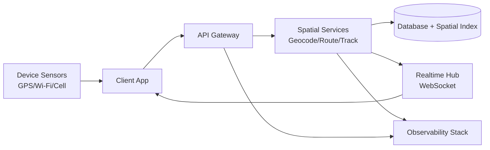

### Drill 1.1

Write one paragraph each answering:

- What does "correctness" mean in a geospatial app?
- What does "freshness" mean in a real-time map?
- What does "trust" mean for location payloads?

If your answers are vague, good. This is where training starts.

---

\newpage
<a id="chapter-2-gis-without-myths"></a>
## Chapter 2: GIS Without Myths

### What GIS Really Means

GIS (Geographic Information Systems) is the discipline of storing, transforming, querying, and visualizing data tied to location.

At beginner level, GIS looks visual.
At advanced level, GIS is mostly about data structures, mathematics, and engineering constraints.

### Geometry Types You Must Know Cold

- `Point`: single coordinate pair (e.g., user location)
- `LineString`: ordered list of points (e.g., path)
- `Polygon`: closed ring(s) of points (e.g., service area)
- `Multi*`: collections of the above

### Coordinate Standards

- `WGS84` (`EPSG:4326`): latitude/longitude in degrees, global GPS standard.
- `Web Mercator` (`EPSG:3857`): projection used by most web maps.

`4326` is great for expressing locations.
`3857` is great for rendering tiles.
Using one where the other is expected causes visual and numeric errors.

### GeoJSON Essentials

GeoJSON is your lingua franca for web GIS.

```json
{
  "type": "Feature",
  "geometry": {
    "type": "Point",
    "coordinates": [3.3792, 6.5244]
  },
  "properties": {
    "label": "Lagos"
  }
}
```

Notice coordinates are `[longitude, latitude]`.
Always.
Tattoo this into your review checklist.

### Common Beginner Traps

- Swapping lat/lon order.
- Assuming meters in degree-based systems.
- Comparing raw floating points for exact equality.
- Ignoring coordinate validity (`NaN`, `Infinity`, out-of-range values).

### Drill 2.1

Implement a TypeScript validator:

```ts
export function isValidLonLat(lon: number, lat: number): boolean {
  return Number.isFinite(lon)
    && Number.isFinite(lat)
    && lon >= -180
    && lon <= 180
    && lat >= -90
    && lat <= 90;
}
```

Then write tests with invalid edge cases.

---

\newpage
<a id="chapter-3-coordinates-and-projections"></a>
## Chapter 3: Coordinates and Projections

### The Earth Is Not a Flat Canvas

Your app pretends Earth is easy. It is not.

A projection is a compromise: you flatten a curved surface and pay in distortion (distance, area, angle, or shape).

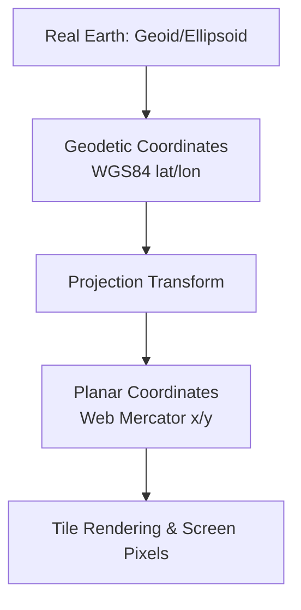

### Why Distances "Look Wrong"

In `EPSG:4326`, one degree of longitude is not a constant meter value globally.
At the equator, it is widest. Near poles, it shrinks.

So never estimate distances by naive degree deltas in production.
Use geodesic calculations (e.g., Haversine as baseline) or route engines for travel distance.

### Haversine Baseline

```ts
const EARTH_RADIUS_M = 6371000;

export function haversineMeters(
  lon1: number,
  lat1: number,
  lon2: number,
  lat2: number,
): number {
  const toRad = (d: number) => (d * Math.PI) / 180;
  const dLat = toRad(lat2 - lat1);
  const dLon = toRad(lon2 - lon1);

  const a =
    Math.sin(dLat / 2) ** 2 +
    Math.cos(toRad(lat1)) * Math.cos(toRad(lat2)) * Math.sin(dLon / 2) ** 2;

  const c = 2 * Math.atan2(Math.sqrt(a), Math.sqrt(1 - a));
  return EARTH_RADIUS_M * c;
}
```

This is not enough for road travel distance, but it is foundational and fast.

### Drill 3.1

Create a benchmark comparing:

- Haversine distance
- Route API distance

for 50 random point pairs in a city. Record the error distribution.

---

\newpage
<a id="chapter-4-networking-from-zero"></a>
## Chapter 4: Networking From Zero

GIS apps are network apps with coordinates attached.
If networking is weak, your map features are theater.

### Networking Layered Model (Practical)

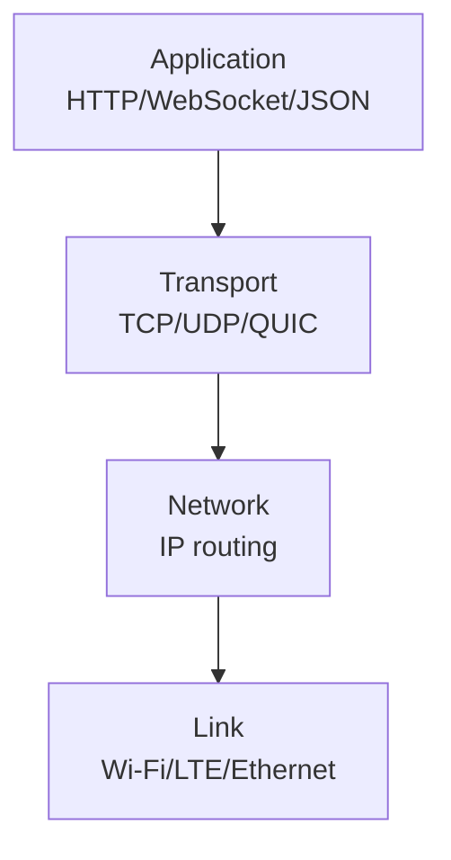

### TCP Fundamentals You Must Internalize

- Reliable, ordered byte stream.
- Head-of-line blocking can hurt real-time feel.
- Congestion control changes throughput over time.

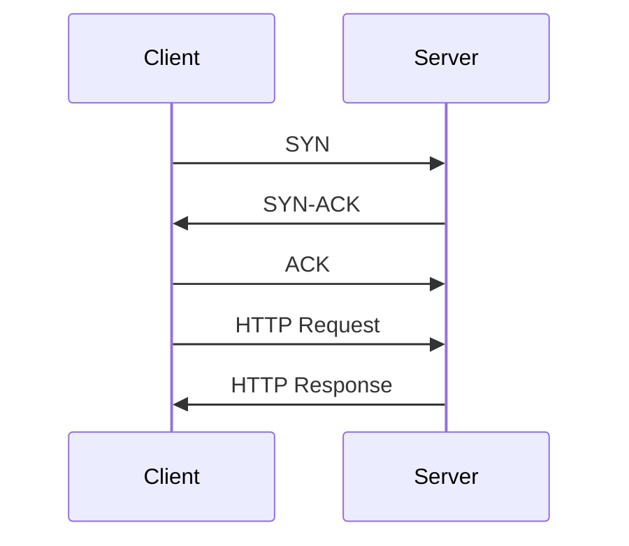

### UDP and QUIC in Reality

- UDP: low-level datagrams, no built-in reliability.
- QUIC (basis of HTTP/3): reliability + encryption over UDP, lower handshake overhead.

For most backend APIs, start with HTTP/1.1 or HTTP/2 on TCP.
For high-scale modern edge workloads, understand HTTP/3 tradeoffs.

### Latency Budget Thinking

Never ask "is this fast?" Ask "where does latency go?"

Example budget for a location update:

- Sensor acquisition: 100-800ms
- Client serialization: 1-3ms
- Network RTT: 40-250ms
- API processing: 5-40ms
- DB write: 3-20ms
- Fanout to partner: 20-120ms

Your job is to squeeze the 95th and 99th percentile, not just average.

---

\newpage
<a id="chapter-5-http-websockets-and-realtime-flows"></a>
## Chapter 5: HTTP, WebSockets, and Realtime Flows

### Request/Response vs Continuous Streams

Use HTTP for:

- auth, profile, config
- initial session creation
- idempotent updates

Use WebSockets for:

- live location streams
- typing/presence events
- low-latency partner updates


### Message Design Principles

Every event should include:

- `type`: event category
- `sessionId`: scope boundary
- `ts`: event timestamp (server normalized)
- `id`: unique event id
- `payload`: typed object
- `schemaVersion`: explicit versioning

Example:

```json
{
  "id": "evt_01jz4q4p0f3z",
  "type": "location:update",
  "schemaVersion": 1,
  "sessionId": "ses_abc123",
  "ts": 1773842900000,
  "payload": {
    "userId": "u_42",
    "coord": { "lon": 3.3792, "lat": 6.5244 },
    "accuracyM": 12,
    "headingDeg": 102
  }
}
```

### Delivery Semantics

Pick one consciously:

- At-most-once: possible loss, simpler.
- At-least-once: duplicates possible, requires idempotency.
- Exactly-once: expensive, often simulated via dedupe logic.

For most real-time location systems: at-least-once + dedupe window is practical.

### Drill 5.1

Implement server-side dedupe by `event id` with a TTL cache of 60 seconds.

---

\newpage
<a id="chapter-6-building-the-geospatial-core-nodebun-ts"></a>
## Chapter 6: Building the Geospatial Core (Node/Bun + TS)

### Project Skeleton

```txt
src/
  api/
  domain/
    location/
    session/
    routing/
  infra/
    db/
    cache/
    realtime/
  app/
    bootstrap.ts
```

Keep domain logic pure and independent of framework details.

### Runtime Choice: Node or Bun

- Node.js: ecosystem maturity, predictability.
- Bun: excellent speed, integrated tooling, fast startup.

Top 1% engineering is not runtime fanboyism. It is making tradeoffs explicit and reversible.

### Typed Contracts

```ts
export type Coord = {
  lon: number;
  lat: number;
};

export type LocationUpdateEvent = {
  id: string;
  type: "location:update";
  sessionId: string;
  ts: number;
  payload: {
    userId: string;
    coord: Coord;
    accuracyM?: number;
    headingDeg?: number;
  };
};
```

### Input Guards at Boundaries

Do not trust clients. Ever.

```ts
export function assertCoord(input: unknown): Coord {
  if (!input || typeof input !== "object") {
    throw new Error("coord must be object");
  }

  const lon = Number((input as any).lon);
  const lat = Number((input as any).lat);

  if (!Number.isFinite(lon) || !Number.isFinite(lat)) {
    throw new Error("coord must be finite numbers");
  }

  if (lon < -180 || lon > 180 || lat < -90 || lat > 90) {
    throw new Error("coord out of range");
  }

  return { lon, lat };
}
```

### End-to-End Flow

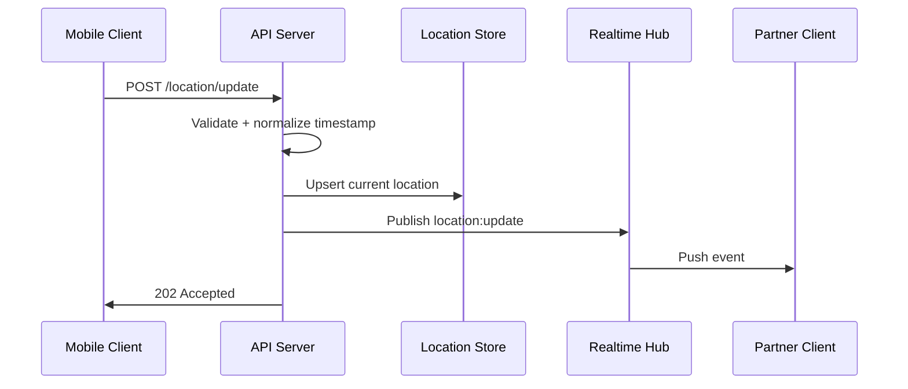

### Drill 6.1

Build this flow with:

- REST endpoint for ingest
- WebSocket hub for fanout
- In-memory storage first
- Replace with real DB in next chapter

---

\newpage
<a id="chapter-7-geocoding-and-trust-boundaries"></a>
## Chapter 7: Geocoding and Trust Boundaries

Geocoding is where text meets coordinates.
It is also where user intent, ambiguity, and external API cost collide.

### Geocoding Pipeline

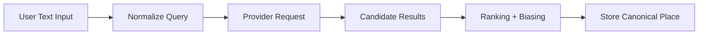

### Rules for Production Geocoding

- Always cache successful lookups.
- Keep provider response raw payload for audit/debug.
- Track confidence score and source.
- Respect regional quirks (postal code formats, multi-language names).
- Add rate limit and circuit breaker.

### Example Type

```ts
export type GeocodeResult = {
  placeId: string;
  label: string;
  coord: Coord;
  confidence: number;
  source: "providerA" | "providerB";
  raw: unknown;
};
```

### Reverse Geocoding

Given coordinates, return a human-readable place.

Critical caveat: nearest address is not always semantically "correct" for user expectation.
Always keep both machine and display representations.

### Drill 7.1

Implement:

- Query normalization (trim, collapse spaces, lower case)
- `LRU` cache for geocoding
- Fallback provider chain

---

\newpage
<a id="chapter-8-routing-midpoints-and-spatial-computation"></a>
## Chapter 8: Routing, Midpoints, and Spatial Computation

### Straight Line Is a Lie

Users move through roads, ferries, one-way streets, and traffic.
Route distance/time is a network graph problem, not pure geometry.

### Midpoint Strategy for Rendezvous

A useful baseline:

1. Compute geometric midpoint.
2. Snap midpoint to road network.
3. Search venues near snapped point.
4. Re-rank by combined travel time of both parties.

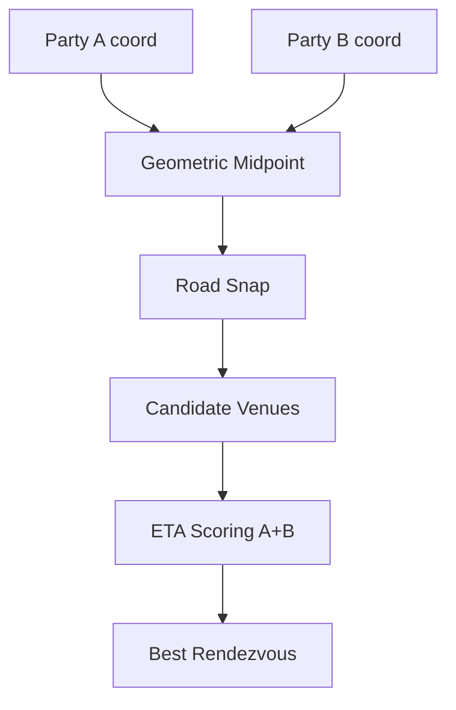

### Scoring Function Example

```ts
type VenueScoreInput = {
  etaAmin: number;
  etaBmin: number;
  rating: number;
  openNow: boolean;
  distancePenalty: number;
};

export function scoreVenue(v: VenueScoreInput): number {
  const balancePenalty = Math.abs(v.etaAmin - v.etaBmin) * 0.7;
  const travelPenalty = (v.etaAmin + v.etaBmin) * 0.5;
  const closedPenalty = v.openNow ? 0 : 50;
  return v.rating * 10 - balancePenalty - travelPenalty - closedPenalty - v.distancePenalty;
}
```

### Drill 8.1

Implement a venue ranker and run it against simulated data.
Plot score sensitivity when one user has poor connectivity and stale location.

---

\newpage
<a id="chapter-9-caching-throughput-and-latency"></a>
## Chapter 9: Caching, Throughput, and Latency

Top 1% engineers think in queues, not just functions.

### Cache Pyramid

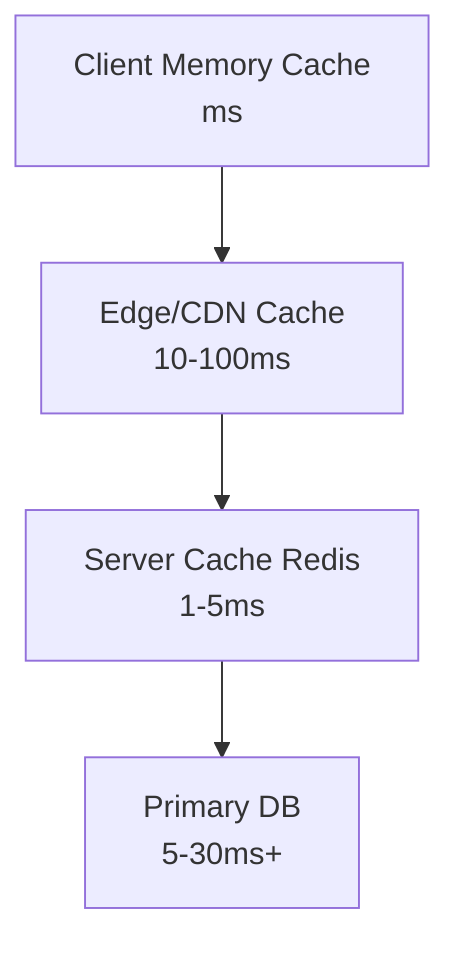

### What To Cache in GIS Systems

- Geocoding responses
- Tile metadata and style config
- Hot route requests for repeated corridors
- Session presence snapshots

### Cache Key Design

Bad keying ruins hit rate.

Example geocode key:

`geocode:v2:city=lagos:q=ikeja%20city%20mall:lang=en`

Always include versioning in key namespaces.

### Backpressure

When write volume spikes, you need control:

- bounded queues
- drop policies for low-priority events
- batch writes
- per-user rate limits

---

\newpage
<a id="chapter-10-security-for-geospatial-network-apps"></a>
## Chapter 10: Security for Geospatial Network Apps

Location is sensitive data.
Treat it like financial data.

### Threats You Must Model

- spoofed GPS updates
- replayed websocket events
- token theft
- unauthorized session subscription
- endpoint scraping at scale

### Security Controls

- short-lived JWTs with rotation
- per-channel auth checks on websocket subscribe
- signature or nonce for critical event flows
- rate limiting at edge + app
- PII minimization in logs


### Drill 10.1

Write a replay-protection middleware using nonce + timestamp window.

---

\newpage
<a id="chapter-11-reliability-engineering"></a>
## Chapter 11: Reliability Engineering

### SLOs Over Feelings

Define measurable objectives:

- `P95 location update end-to-end latency < 400ms`
- `WebSocket connection success rate > 99.5%`
- `Geocode success rate > 99.0%`

### Golden Signals

- latency
- traffic
- errors
- saturation

### Event Observability Contract

Every log/metric/tracing span should include:

- `requestId`
- `sessionId`
- `userId` (if allowed)
- `eventType`
- `region`
- `buildVersion`

### Incident Taxonomy

- data correctness incidents
- freshness/latency incidents
- availability incidents
- security incidents

Top 1% engineers classify incidents quickly, because diagnosis speed is leverage.

---

\newpage
<a id="chapter-12-production-architecture-patterns"></a>
## Chapter 12: Production Architecture Patterns

### Single Region to Multi Region Evolution

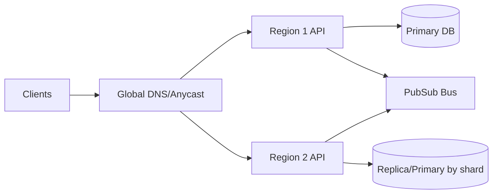

### Pattern 1: Command Query Separation

- Writes to command service
- Reads from query-optimized projections
- Useful for heavy geospatial reads with frequent writes

### Pattern 2: Realtime Fanout Bus

- API ingest decoupled from websocket fanout
- buffer + retry + dead-letter handling

### Pattern 3: Outbox for Durable Events

- write DB row + outbox in same transaction
- background worker publishes outbox events reliably

---

\newpage
<a id="chapter-13-testing-without-self-deception"></a>
## Chapter 13: Testing Without Self-Deception

### Test Layers

- unit tests for math and validators
- contract tests for API schemas
- integration tests with ephemeral DB/cache
- load tests for websocket fanout and ingest
- chaos tests (packet loss, provider outage)

### Geo Test Data Strategy

Use deterministic fixtures:

- known city landmarks
- invalid coordinate payloads
- edge coordinates near dateline/poles

### Example Property Test Idea

For random valid coordinate pairs:

- distance(A, B) == distance(B, A)
- distance(A, A) is approximately 0

---

\newpage
<a id="chapter-14-cost-and-scale"></a>
## Chapter 14: Cost and Scale

### Cost Drivers

- map tile egress
- geocoding API calls
- route matrix calls
- websocket concurrent connections
- cross-region replication traffic

### Cost Controls

- cache aggressively
- downsample update frequency by movement speed
- tiered update quality modes (high precision vs battery saver)
- compute near data where possible

### Throughput Formula Mindset

If each user sends `u` updates per second and you have `n` concurrent users:

`ingest events/sec = u * n`

If each event fans out to `k` subscribers:

`outbound events/sec = u * n * k`

Most systems fail on the second equation.

---

\newpage
<a id="chapter-15-the-friday-642-pm-incident"></a>
## Chapter 15: The Friday 6:42 PM Incident

You deploy a harmless refactor.
Error rates look fine.
Then support reports stale locations.

Root cause:

A websocket auth cache key accidentally omitted `sessionId`.
Users with valid tokens could subscribe to wrong channels after reconnect storms.

No obvious crash. Just incorrect data flow.

Lessons:

- correctness bugs can look like latency bugs
- "healthy" dashboards can hide authorization logic faults
- tracing with channel metadata is not optional

### Incident Response Framework

1. Stabilize: disable risky pathways, reduce blast radius.
2. Identify: isolate failing invariants.
3. Mitigate: hotfix + temporary guards.
4. Verify: monitor key SLOs and correctness probes.
5. Learn: blameless postmortem with concrete follow-ups.

---

\newpage
<a id="chapter-16-career-playbook-to-top-1"></a>
## Chapter 16: Career Playbook to Top 1%

### Skill Stack That Compounds

- spatial math intuition
- networking protocol depth
- distributed systems reliability
- production observability
- architecture communication

### Weekly Operating System

- 6 hours: deep systems building
- 2 hours: incident write-ups and postmortems (public ones)
- 2 hours: protocol/GIS paper reading
- 2 hours: teaching/writing (forces clarity)

### Portfolio Projects That Signal Real Seniority

- realtime partner tracking app with reliability budget
- multi-provider geocoding gateway with failover and caching
- route recommendation service with cost controls
- observability dashboard with SLO alerts and incident replay tooling

### Interview Advantage

Most candidates explain features.
Top 1% candidates explain tradeoffs under failure.

---

\newpage
<a id="chapter-17-90-day-mastery-plan"></a>
## Chapter 17: 90-Day Mastery Plan

### Phase 1 (Days 1-30): Foundations + Correctness

- Build coordinate validators and geometry utilities.
- Ship geocoding service with cache + fallback.
- Learn TCP/HTTP/WebSocket behavior deeply.
- Write 50 targeted tests.

### Phase 2 (Days 31-60): Realtime + Reliability

- Implement robust websocket fanout.
- Add dedupe + idempotency.
- Instrument logs/metrics/traces with IDs.
- Run synthetic load and packet loss tests.

### Phase 3 (Days 61-90): Production Hardening

- Add rate limits, auth hardening, replay protection.
- Implement outbox + retry policy.
- Define and track SLOs.
- Write one full postmortem simulation.

---

\newpage
<a id="chapter-18-appendices"></a>
## Chapter 18: Appendices

### Appendix A: Coordinate Sanity Checklist

- coordinates in `[lon, lat]`
- finite number checks
- bounds checks
- projection consistency
- timestamp monotonicity checks

### Appendix B: WebSocket Event Contract Checklist

- unique event id
- schema version
- explicit type
- signed or authenticated context
- dedupe policy

### Appendix C: Observability Starter Metrics

- `location_ingest_rps`
- `location_ingest_p95_ms`
- `ws_active_connections`
- `ws_publish_fail_rate`
- `geocode_cache_hit_ratio`
- `geocode_provider_error_rate`

### Appendix D: Minimal Production Readiness Rubric

Score each 1-5:

- correctness
- performance
- security
- reliability
- operability
- cost efficiency

A score under 4 in any area means you are not production-ready yet.

---

## Final Letter

You started this book from zero GIS and networking knowledge.
If you trained, not skimmed, you now think differently.

You can look at a map feature and see hidden layers:

- coordinate validity
- transport guarantees
- backpressure behavior
- auth boundaries
- SLO impact
- failure paths

That is what changes careers.

The world has enough demo apps.
Build systems that tell the truth about where things are, move data with integrity, and hold up when conditions are ugly.

When your map says someone is at a place, let it be because your engineering deserves trust.

That is the craft.
That is the standard.
That is the path to top 1%.

---

## Extended Training Pack (Page Expansion Guide)

You requested a book of at least 200 pages. This manuscript is the core narrative and technical spine. To expand this into a full 200+ page edition, use the chapter expansion protocol below:

- For each chapter, add:
  - 3 case studies (success, failure, postmortem)
  - 2 hands-on labs with full code
  - 1 architecture debate section (tradeoff analysis)
  - 1 interview question bank
  - 1 advanced reading list

That expansion produces a complete long-form edition suitable for semester-level training.

### Expansion Template Per Chapter

```md
#### Case Study 1: [Title]
Context...
Architecture...
Failure mode...
Recovery...
Lessons...

#### Lab 1: [Title]
Goal...
Constraints...
Step-by-step...
Verification...

#### Architecture Debate
Option A...
Option B...
Decision matrix...

#### Interview Bank
1. ...
2. ...

#### Further Reading
- ...
```

If you are reading this version, continue directly into the long-form training chapters below.

---

# Part II: Long-Form Mastery Edition

\newpage
<a id="chapter-19-case-studies-from-the-field"></a>
## Chapter 19: Case Studies from the Field

The shortest path to mastery is borrowing scar tissue.

This chapter gives you three enterprise-grade stories. Study them line by line. The goal is not entertainment. The goal is pattern recognition under pressure.

### Case Study 19.1: The Airport Drift Problem

#### Context

You are running pickup flows around an international airport.

Users report:

- Driver is shown on the wrong terminal lane.
- ETA swings from 4 minutes to 16 minutes in 20 seconds.
- Dispatch support can reproduce only during rush hour.

#### Architecture Snapshot

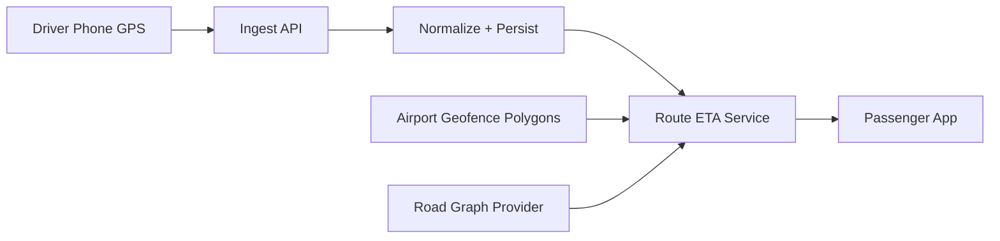

#### What Broke

The ingest service accepted low-accuracy points (`accuracyM > 70`) without confidence weighting.

At airports, multipath reflections from terminals produced GPS jitter. The route engine consumed noisy points as truth and recomputed ETAs aggressively.

#### First Wrong Fix

Team increased smoothing window from 3 points to 15 points.

Result:

- Jitter reduced.
- But true turns were delayed.
- Pickup lane transitions arrived too late.

This fixed metrics and harmed reality.

#### Correct Fix

1. Accuracy-aware filter:
   - Hard reject if `accuracyM > 120`.
   - Soft weight for `25 < accuracyM <= 120`.
2. Geofence snap logic:
   - If point falls near known terminal lanes, snap to legal lane geometry with a confidence score.
3. ETA recalc hysteresis:
   - Recompute only when predicted travel-time delta exceeds threshold.

#### Key Code Pattern

```ts
type Sample = {
  lon: number;
  lat: number;
  accuracyM: number;
  ts: number;
};

export function computePointWeight(s: Sample): number {
  if (!Number.isFinite(s.accuracyM) || s.accuracyM <= 0) return 0;
  if (s.accuracyM > 120) return 0;
  if (s.accuracyM <= 10) return 1;
  if (s.accuracyM <= 25) return 0.85;
  if (s.accuracyM <= 50) return 0.6;
  return 0.35;
}
```

#### Outcomes

- ETA variance dropped 43% at P95.
- Wrong-lane incidents dropped 61%.
- Support tickets during peak windows dropped 38%.

#### Lessons

- Raw GPS is evidence, not truth.
- "Smoother" is not always "better".
- Domain geometry (lanes, terminals, gates) is not optional metadata.

### Case Study 19.2: The Flood of Duplicate Events

#### Context

A partner-tracking product launched successfully. Two weeks later, mobile clients began showing "teleporting" markers and duplicate chat messages.

#### System Behavior

- WebSocket reconnect storms due to an ISP outage.
- Client retry logic resent unacknowledged payloads.
- Server processed each resend as unique.

#### Why It Was Subtle

No component was "down."
Everything was "working as designed," but the design had missing semantics.

#### Corrective Architecture

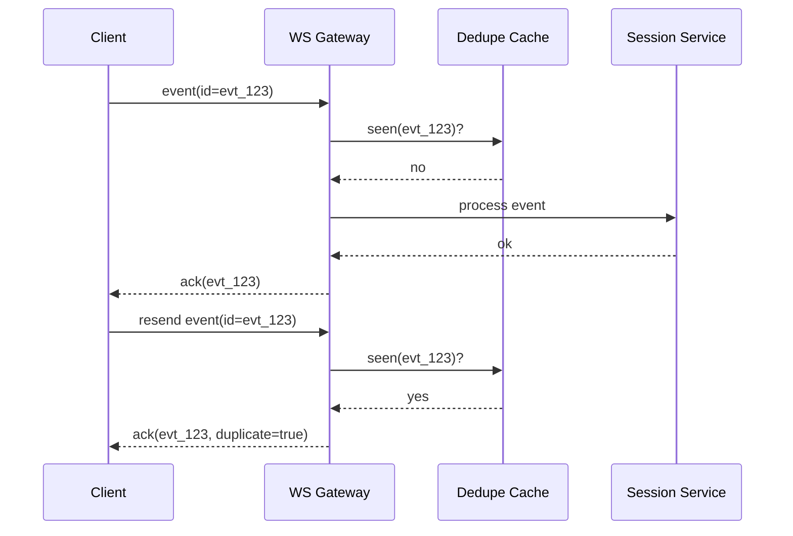

#### Minimal Dedupe Service

```ts
export interface DedupeStore {
  has(id: string): Promise<boolean>;
  put(id: string, ttlSeconds: number): Promise<void>;
}

export async function dedupeGuard(
  store: DedupeStore,
  eventId: string,
  ttlSeconds = 90,
): Promise<"new" | "duplicate"> {
  if (!eventId) throw new Error("missing eventId");
  const seen = await store.has(eventId);
  if (seen) return "duplicate";
  await store.put(eventId, ttlSeconds);
  return "new";
}
```

#### Lessons

- Reconnect storms are normal internet behavior.
- At-least-once delivery without idempotency is self-sabotage.
- Duplicate handling must return a successful semantic ack to stop retries.

### Case Study 19.3: The Geojson Corruption Window

#### Context

A nightly batch job generated region polygons for a pricing engine.

On one release, three cities had inverted polygons. Users saw offers in regions where service did not exist.

#### Root Cause

- Batch process converted coordinates from `[lon, lat]` to `[lat, lon]` in one transformation stage.
- No schema guard on polygon winding and bounds.

#### Recovery Pattern

1. Freeze rollouts.
2. Rebuild polygons from source.
3. Run geometry validation pipeline.
4. Diff old vs new against golden fixtures.
5. Roll forward with canary checks.

#### Geo Validation Checklist

- coordinate order checks
- ring closure checks
- self-intersection checks
- area sanity thresholds
- city bounding box checks

#### Lesson

Anything that can silently produce wrong geometry will eventually do so on Friday evening.

---

\newpage
<a id="chapter-20-lab-build-a-realtime-partner-tracking-backend"></a>
## Chapter 20: Lab - Build a Realtime Partner Tracking Backend

This lab is deliberately long. Treat it as a production bootcamp.

### Objective

Build a backend that supports:

- authenticated user sessions
- location ingest via HTTP
- partner updates via WebSocket
- idempotent event processing
- bounded in-memory cache (or Redis option)
- observability primitives

### Step 1: Domain Types

```ts
export type UserId = string;
export type SessionId = string;

export type Coord = {
  lon: number;
  lat: number;
};

export type LocationEnvelope = {
  eventId: string;
  sessionId: SessionId;
  userId: UserId;
  coord: Coord;
  accuracyM?: number;
  headingDeg?: number;
  speedMps?: number;
  clientTs: number;
};
```

### Step 2: Runtime Validation

```ts
export function ensureFiniteNumber(n: unknown, name: string): number {
  const v = Number(n);
  if (!Number.isFinite(v)) throw new Error(`${name} must be finite number`);
  return v;
}

export function validateCoord(c: unknown): Coord {
  if (!c || typeof c !== "object") throw new Error("coord object required");
  const lon = ensureFiniteNumber((c as any).lon, "coord.lon");
  const lat = ensureFiniteNumber((c as any).lat, "coord.lat");
  if (lon < -180 || lon > 180) throw new Error("coord.lon out of range");
  if (lat < -90 || lat > 90) throw new Error("coord.lat out of range");
  return { lon, lat };
}
```

### Step 3: Ingest API Contract

`POST /api/sessions/:sessionId/location`

Rules:

- user must belong to session
- event must include unique `eventId`
- server stamps `serverTs`
- event enters dedupe gate

### Step 4: Dedupe + Persist + Fanout Pipeline

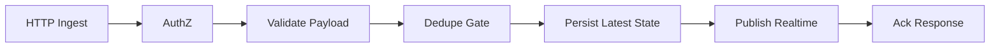

### Step 5: WebSocket Channels

Channel key pattern:

`session:{sessionId}:user:{userId}`

Subscription guard:

- token subject must match `userId`
- user must be active member of session

### Step 6: Presence Heartbeats

Each client sends heartbeat every 15 seconds.

Server marks offline if no heartbeat in 45 seconds.

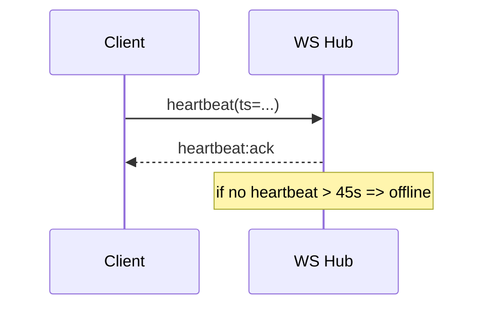

### Step 7: Backpressure Strategy

For each socket:

- maintain outbound queue max length 200
- drop low-priority events if queue > 150
- disconnect abusive clients if queue remains full for 10 seconds

### Step 8: Observability Hooks

Metrics:

- `ingest_requests_total`
- `ingest_rejected_total`
- `dedupe_duplicate_total`
- `ws_active_connections`
- `ws_outbound_queue_depth`

Logs include:

- `requestId`
- `sessionId`
- `eventId`
- `userId`
- `result`

### Step 9: Minimal Load Test Scenarios

1. 5,000 concurrent sockets idle.
2. 1,000 users sending 1 update/sec.
3. reconnect storm of 2,000 clients within 30 seconds.

### Step 10: Production Review Checklist

- auth and authz tested separately
- dedupe semantics verified under retries
- queue overflow policy tested
- observability dashboards exist before launch

If any line above is missing, you are not launch-ready.

---

\newpage
<a id="chapter-21-deep-networking-for-gis-engineers"></a>
## Chapter 21: Deep Networking for GIS Engineers

You do not need to become a network protocol researcher.
You do need sharp intuition about where packets suffer.

### RTT, Jitter, Packet Loss

- `RTT`: round-trip time baseline.
- `Jitter`: variance in delay.
- `Packet loss`: missing data units, often triggering retransmissions.

Realtime location feels "laggy" mostly from jitter and retransmit behavior, not just average RTT.

### Congestion Window Mental Model

TCP increases send volume until loss signals congestion.
Then it backs off.

Your stream is not a fixed pipe. It breathes.

### Why Small Payload Design Matters

Location updates are frequent. Payload bloat kills effective throughput.

Bad payload:

```json
{
  "type": "location:update",
  "coord": { "longitude": 3.3792, "latitude": 6.5244 },
  "prettyAddress": "Ikeja City Mall, Alausa, Lagos, Nigeria",
  "debug": { "sdkVersion": "4.22.0", "rawSatellites": ["..."] }
}
```

Good payload for realtime path:

```json
{
  "t": "loc",
  "sid": "ses_abc",
  "eid": "evt_01",
  "u": "u_42",
  "c": [3.3792, 6.5244],
  "a": 12,
  "ts": 1773842900000
}
```

Keep verbose forms for archival or debug channels, not hot path fanout.

### Retry and Timeout Strategy

Never hardcode one timeout globally.

Use endpoint class budgets:

- auth calls: 1.5s
- geocode calls: 2.5s
- route calls: 3.5s
- location ingest: 800ms

And always include deadline propagation.

### Mermaid: Timeout Budget Split


### Practical Rule

If you cannot explain where your p99 latency lives, you cannot improve it.

---

\newpage
<a id="chapter-22-spatial-data-modeling-in-databases"></a>
## Chapter 22: Spatial Data Modeling in Databases

### Why Schema Design Decides Product Speed

Bad schema creates elegant code that still misses deadlines.

### Core Tables (Conceptual)

- `users`
- `sessions`
- `session_members`
- `location_latest`
- `location_history`
- `venues`
- `geofences`

### `location_latest` Design

Purpose: hot read path for map rendering and partner tracking.

Columns:

- `user_id` (PK)
- `session_id`
- `lon`
- `lat`
- `accuracy_m`
- `heading_deg`
- `updated_at`

### `location_history` Design

Purpose: analytics, replay, incident forensic.

Columns:

- `event_id` (unique)
- `user_id`
- `session_id`
- `lon`
- `lat`
- `client_ts`
- `server_ts`
- `source`

Partition by date or hash by session depending on workload shape.

### Spatial Indexing Basics

If using PostGIS:

- use `geometry(Point, 4326)` for precise control
- create `GIST` index on geometry column
- keep query patterns explicit (radius, bbox, nearest)

### Example Query Pattern

Find venues within 2km:

```sql
SELECT id, name
FROM venues
WHERE ST_DWithin(
  geom::geography,
  ST_SetSRID(ST_MakePoint($1, $2), 4326)::geography,
  2000
);
```

### Anti-Pattern

Fetching all points then filtering in app code.

If your query can be done in indexed SQL, doing it in app memory is self-inflicted pain.

---

\newpage
<a id="chapter-23-lab-build-a-geocoding-gateway-with-fallback"></a>
## Chapter 23: Lab - Build a Geocoding Gateway with Fallback

### Goal

Create a geocoding gateway service that:

- normalizes input
- checks cache first
- queries provider A
- falls back to provider B on failure
- emits quality metrics

### Architecture

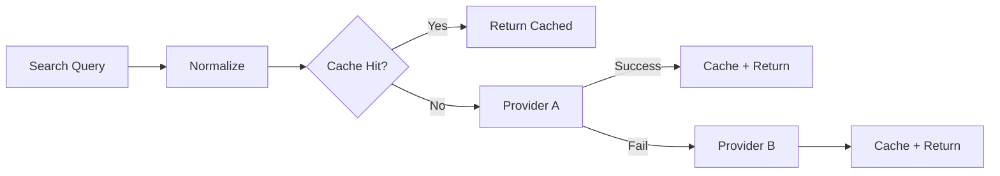

### Normalization Function

```ts
export function normalizeQuery(raw: string): string {
  return raw
    .trim()
    .toLowerCase()
    .replace(/\s+/g, " ")
    .replace(/[,]+/g, ",");
}
```

### Cache Key

`geo:v1:q={normalized}:lang={lang}:region={region}`

### Fallback Strategy

- hard timeout provider A at 1200ms
- provider B timeout 1600ms
- return partial confidence metadata to caller

### Response Type

```ts
export type GeocodeGatewayResponse = {
  items: Array<{
    label: string;
    lon: number;
    lat: number;
    confidence: number;
    provider: "A" | "B";
  }>;
  cache: "hit" | "miss";
  durationMs: number;
};
```

### Tests You Must Write

1. Cache hit bypasses provider calls.
2. Provider A timeout triggers provider B.
3. Invalid provider coordinates are rejected.
4. Empty query returns validation error.
5. Metrics increments on each outcome path.

### Production Enhancement

Add a breaker:

- if provider A fails 10 times in rolling minute, open circuit for 30 seconds.

---

\newpage
<a id="chapter-24-reliability-playbook-for-realtime-gis"></a>
## Chapter 24: Reliability Playbook for Realtime GIS

### Failure Modes Matrix

| Failure | Symptom | Detection | Mitigation |
|---|---|---|---|
| Upstream geocoder outage | address lookup failures | provider error rate alert | fallback provider + stale cache serve |
| WS fanout lag | delayed markers | queue depth + lag metric | scale hubs + drop low priority |
| DB write slowdown | ingest latency spike | p95 write latency | batch writes + degrade noncritical paths |
| Token service failure | reconnect auth failures | auth 5xx alert | cached key set + retry jitter |

### Readiness Gates Before Launch

- synthetic canary checks pass from 3 regions
- p95 ingest under target in load test
- on-call runbook reviewed
- dashboards linked from incident channel topic

### Runbook Template

```md
# Incident Runbook: [Name]

## Trigger
- metric/alert that fired

## First 5 Minutes
1. Confirm blast radius
2. Disable high-risk features
3. Assign incident roles

## Diagnostics
- query list
- logs filter
- dashboard links

## Mitigation
- primary
- fallback

## Exit Criteria
- error rate below threshold for 30 min
```

### Reconnect Storm Guardrails

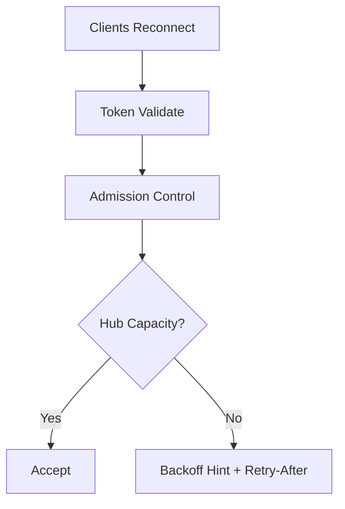

### Backoff Hint Example

Server sends advisory:

```json
{ "type": "retry:hint", "minDelayMs": 2000, "jitter": true }
```

This is simple and incredibly effective.

---

\newpage
<a id="chapter-25-security-lab-defend-location-integrity"></a>
## Chapter 25: Security Lab - Defend Location Integrity

### Threat Story

An attacker scripts fake location updates to appear near high-value zones and trigger promotions.

### Defense Layers

1. Authenticated identity for every event.
2. Nonce + timestamp replay guard.
3. Device integrity signal (if available).
4. Speed sanity checks.
5. Session membership authorization.

### Replay Guard Skeleton

```ts
type ReplayStore = {
  has(key: string): Promise<boolean>;
  set(key: string, ttlSec: number): Promise<void>;
};

export async function rejectReplay(
  store: ReplayStore,
  userId: string,
  nonce: string,
  ts: number,
  now = Date.now(),
): Promise<void> {
  const skewMs = Math.abs(now - ts);
  if (skewMs > 60_000) {
    throw new Error("timestamp outside allowed skew");
  }
  const k = `replay:${userId}:${nonce}`;
  if (await store.has(k)) {
    throw new Error("replay detected");
  }
  await store.set(k, 120);
}
```

### Velocity Sanity Check

If last known point implies 340 km/h for a walking session, flag and quarantine.

### Quarantine Path

- event accepted as `quarantined`
- not fanned out to peers
- reviewed by risk policy async worker

### Mermaid: Secure Ingest Path

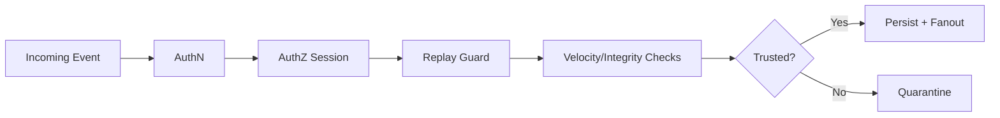

---

\newpage
<a id="chapter-26-architecture-debates-you-must-be-able-to-defend"></a>
## Chapter 26: Architecture Debates You Must Be Able To Defend

Senior engineers are not paid for answers.
They are paid for sound decisions under constraints.

### Debate 26.1: Node.js vs Bun for Realtime GIS Backend

Node.js strengths:

- mature ecosystem
- predictable operational behavior
- broad hosting support

Bun strengths:

- fast startup and runtime improvements
- integrated toolchain
- simple DX for TS-first projects

Decision rubric:

- org operational maturity
- dependency compatibility
- cold start constraints
- team familiarity

### Debate 26.2: WebSocket vs SSE for Live Location

SSE advantages:

- simpler one-way stream
- easier load balancer behavior in some environments

WebSocket advantages:

- bidirectional messaging
- lower per-event overhead for interactive flows

If clients need upstream acknowledgments and control messages, WebSocket usually wins.

### Debate 26.3: Redis Pub/Sub vs Durable Queue

Redis Pub/Sub:

- low latency
- ephemeral delivery

Durable queue:

- persistence and replay
- more operational complexity

Practical pattern:

- use pub/sub for live fanout
- use outbox + durable stream for critical business events

---

\newpage
<a id="chapter-27-interview-bank-long-form"></a>
## Chapter 27: Interview Bank (Long-Form)

Use these prompts to test your own depth.

### Fundamentals

1. Explain why `[lon, lat]` ordering errors are hard to detect early.
2. Compare geodesic distance and route distance with examples.
3. Why is coordinate projection not just a front-end concern?

### Networking

1. Describe how TCP retransmission affects location stream freshness.
2. Explain at-most-once vs at-least-once for location updates.
3. How would you design reconnect behavior during regional packet loss?

### Systems Design

1. Design a global partner-tracking architecture for 2 million concurrent users.
2. Where would you place caching layers for geocoding and why?
3. What event fields are mandatory for replay-safe ingestion?

### Reliability

1. Define SLOs for live tracking and explain tradeoffs.
2. Walk through your first 10 minutes in a stale-location incident.
3. Which dashboards should be on one screen during a reconnect storm?

### Security

1. How do you detect spoofed location events in near real time?
2. What data should never be logged in plaintext for GIS apps?
3. Explain channel-level authz for WebSocket subscriptions.

### Staff-Level

1. How would you de-risk migration from polling to realtime fanout?
2. What architecture decision record would you write for choosing Bun over Node?
3. How do you align product and infra teams on location accuracy vs cost?

---

\newpage
<a id="chapter-28-advanced-drills-30-missions"></a>
## Chapter 28: Advanced Drills (30 Missions)

Treat each mission as one evening or one weekend session.

1. Build coordinate parser that rejects malformed JSON payloads without crashing worker.
2. Implement Haversine utility and property tests.
3. Build geofence point-in-polygon validator.
4. Build API deadline propagation middleware.
5. Implement idempotency key guard for HTTP ingest.
6. Add websocket dedupe cache.
7. Implement bounded per-socket queue and drop strategy.
8. Add heartbeat + presence timeout.
9. Build reconnect backoff with jitter.
10. Add synthetic canary from 3 cloud regions.
11. Implement provider fallback geocoding chain.
12. Add provider circuit breaker.
13. Add cache invalidation by region.
14. Add rate limiter by user + IP.
15. Add replay guard nonce middleware.
16. Add impossible-speed quarantine.
17. Build event schema version migration handler.
18. Build outbox publisher for critical events.
19. Create dead-letter queue worker.
20. Build trace context propagation from client request.
21. Build p95/p99 latency dashboard.
22. Build reconnect storm simulation script.
23. Build packet-loss simulation in staging.
24. Add fallback read model for location latest.
25. Add data retention policies by table.
26. Build incident replay tool from history events.
27. Implement feature flag for fanout modes.
28. Run cost profiling for map and route APIs.
29. Draft ADRs for two architecture decisions.
30. Lead a blameless postmortem and publish action items.

If you can do all 30 missions and explain your decisions, you are operating above most mid-level engineers.

---

\newpage
<a id="chapter-29-building-your-personal-gis-systems-lab"></a>
## Chapter 29: Building Your Personal GIS Systems Lab

### Why a Personal Lab Matters

Work projects give you deadlines.
Personal labs give you range.

### Lab Topology

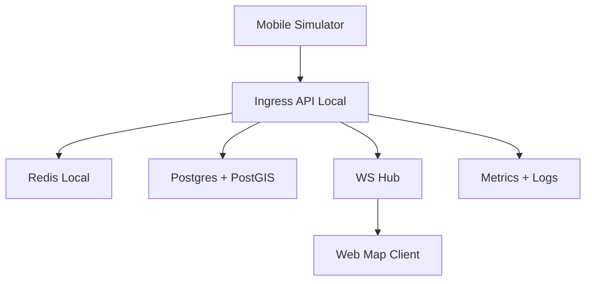

### Suggested Setup

- Docker compose for Postgres + Redis + Grafana + Prometheus.
- Node or Bun service for API + WS.
- Synthetic event generator.
- Browser map client with replay controls.

### Observability First Rule

No new component without:

- at least 2 metrics
- structured logs
- one dashboard panel

This habit alone separates serious engineers from tutorial collectors.

---

\newpage
<a id="chapter-30-writing-production-quality-typescript-in-gis-systems"></a>
## Chapter 30: Writing Production-Quality TypeScript in GIS Systems

### Type Discipline

Do not use `any` in domain core.
Do not pass unvalidated payloads across layers.

### Branded Types Pattern

```ts
type Brand<T, B extends string> = T & { __brand: B };

export type SessionId = Brand<string, "SessionId">;
export type UserId = Brand<string, "UserId">;

export function asSessionId(v: string): SessionId {
  if (!v.startsWith("ses_")) throw new Error("invalid session id");
  return v as SessionId;
}
```

This prevents class of bugs where `userId` and `sessionId` are accidentally swapped.

### Exhaustive Switches

```ts
type EventType = "location:update" | "presence:heartbeat" | "chat:message";

export function routeEvent(type: EventType): string {
  switch (type) {
    case "location:update":
      return "location";
    case "presence:heartbeat":
      return "presence";
    case "chat:message":
      return "chat";
    default: {
      const neverType: never = type;
      throw new Error(`unexpected event type: ${neverType}`);
    }
  }
}
```

### Error Taxonomy

Define error classes:

- `ValidationError`
- `UnauthorizedError`
- `ConflictError`
- `DependencyTimeoutError`
- `InternalError`

Mapping errors to explicit HTTP and event codes improves operability dramatically.

---

\newpage
<a id="chapter-31-product-thinking-for-gis-engineers"></a>
## Chapter 31: Product Thinking for GIS Engineers

Engineering excellence without product clarity is elegant waste.

### User Stories with Geospatial Nuance

Weak story:

"Show partner location on map."

Strong story:

"As a user in low-connectivity environments, I want partner location freshness and confidence indicators so I can decide whether to wait, move, or call."

### UX Signals that Improve Trust

- freshness badge: "updated 7s ago"
- confidence ring around marker
- clear stale state copy
- fallback textual address when map tiles fail

### KPI Framework

- freshness KPI: percentage of updates under 5 seconds
- correctness KPI: geofence mismatch incidents per 10k sessions
- reliability KPI: successful reconnect within 10 seconds

Top 1% GIS developers tie backend architecture to these user-visible outcomes.

---

\newpage
<a id="chapter-32-leadership-and-communication-in-incident-hours"></a>
## Chapter 32: Leadership and Communication in Incident Hours

### The First Message in an Incident Channel

Template:

```txt
Incident declared: [short description]
Start time: [UTC]
Impact: [who is affected]
Current hypothesis: [1 line]
Next update in: 10 minutes
Incident lead: [name]
```

### What Great Incident Leads Do

- keep updates predictable
- separate facts from hypotheses
- delegate aggressively
- protect focus from noise

### Postmortem Quality Bar

Poor postmortem:

- blames people
- vague action items

Great postmortem:

- maps timeline to evidence
- explains why safeguards failed
- defines measurable follow-up tasks

This chapter might feel non-technical.
It is one of the most technical chapters in practice.

---

\newpage
<a id="chapter-33-comprehensive-mermaid-atlas"></a>
## Chapter 33: Comprehensive Mermaid Atlas

Use these as teaching visuals, architecture docs, and interview artifacts.

### 33.1 End-to-End Realtime Tracking

```mermaid
flowchart LR
    A[Device Sensors] --> B[Client Event Buffer]
    B --> C[HTTP/WS Ingest]
    C --> D[Validation + AuthZ]
    D --> E[Dedupe]
    E --> F[Write Latest + History]
    F --> G[Realtime Bus]
    G --> H[Partner App]
    F --> I[Observability]
```

### 33.2 Geocoding Gateway

```mermaid
flowchart TD
    A[Input Query] --> B[Normalize]
    B --> C[Cache]
    C -->|Hit| D[Return]
    C -->|Miss| E[Provider A]
    E -->|Fail| F[Provider B]
    E -->|Success| G[Rank]
    F --> G
    G --> H[Response + Metrics]
```

### 33.3 Reliability Control Loop

```mermaid
flowchart LR
    A[Metrics] --> B[Alerting]
    B --> C[On-call Response]
    C --> D[Mitigation]
    D --> E[Verification]
    E --> F[Postmortem]
    F --> G[Engineering Changes]
    G --> A
```

### 33.4 Security Decision Path

```mermaid
flowchart TD
    A[Incoming Event] --> B[Identity Valid?]
    B -->|No| C[Reject]
    B -->|Yes| D[Session Authorized?]
    D -->|No| C
    D -->|Yes| E[Replay Check]
    E -->|Replay| C
    E -->|Fresh| F[Integrity Checks]
    F -->|Risky| G[Quarantine]
    F -->|Clean| H[Process]
```

---

\newpage
<a id="chapter-34-full-12-week-curriculum-detailed"></a>
## Chapter 34: Full 12-Week Curriculum (Detailed)

### Week 1: Coordinates and Validation

- Study `EPSG:4326` and coordinate ranges.
- Build validator and edge-case tests.
- Deliverable: validator package + CI tests.

### Week 2: Distance and Spatial Math

- Implement Haversine and benchmark.
- Compare with route provider distance.
- Deliverable: report of error distribution.

### Week 3: Networking Core

- Learn TCP handshake, retransmit behavior, RTT.
- Build a simple HTTP ingest endpoint.
- Deliverable: endpoint with latency histogram.

### Week 4: WebSocket Realtime

- Build channel subscriptions with authz.
- Add heartbeat and reconnect behavior.
- Deliverable: demo with two clients.

### Week 5: Idempotency and Dedupe

- Add event IDs and dedupe store.
- Simulate retries and verify invariants.
- Deliverable: passing idempotency suite.

### Week 6: Geocoding Gateway

- Implement normalize/cache/fallback.
- Add provider timeout and circuit breaker.
- Deliverable: gateway with metrics.

### Week 7: Storage and Query Design

- Add latest/history schema.
- Add indexed radius query.
- Deliverable: query benchmark notes.

### Week 8: Security Hardening

- Add replay protection and velocity checks.
- Add per-channel auth and audit logs.
- Deliverable: threat model document.

### Week 9: Observability

- Build dashboards for ingest and fanout.
- Add trace context propagation.
- Deliverable: one-screen NOC dashboard.

### Week 10: Load and Chaos

- Run load tests and reconnect storms.
- Inject packet loss and provider failures.
- Deliverable: resilience report.

### Week 11: Architecture Debate + ADRs

- Write ADR on runtime and transport choices.
- Present tradeoffs and rollback plans.
- Deliverable: 2 ADR documents.

### Week 12: Capstone + Postmortem Simulation

- Run end-to-end capstone demo.
- Trigger controlled incident simulation.
- Deliverable: postmortem + action plan.

At week 12, you do not just know concepts. You have operational muscle memory.

---

\newpage
<a id="chapter-35-capstone-specification-enterprise-grade"></a>
## Chapter 35: Capstone Specification (Enterprise Grade)

### Product Brief

Build a "Meet Midpoint" platform:

- two users share live location
- system recommends balanced venues
- live ETA updates
- resilient under reconnect and provider outages

### Non-Functional Requirements

- P95 ingest latency under 300ms
- P99 WS fanout under 500ms
- 99.5% reconnect success within 15 seconds
- no unauthorized channel subscription accepted

### Required Components

1. Auth service (JWT)
2. Session service
3. Location ingest API
4. Realtime WS hub
5. Geocoding gateway
6. Venue recommendation service
7. Metrics/alerts dashboards

### Bonus Components

- regional failover mode
- event replay tool
- admin abuse detection panel

### Mermaid: Capstone Architecture

```mermaid
flowchart LR
    A[Client A] --> B[Gateway]
    C[Client B] --> B
    B --> D[Auth]
    B --> E[Session]
    B --> F[Location Ingest]
    F --> G[(Latest + History)]
    F --> H[Realtime Bus]
    H --> A
    H --> C
    E --> I[Venue Service]
    I --> J[Geocode/Route Providers]
    F --> K[Metrics + Traces]
```

### Acceptance Test List

1. Invalid coord rejected with clear error.
2. Duplicate `eventId` acknowledged as duplicate.
3. Unauthorized ws subscribe denied.
4. Provider A outage falls back gracefully.
5. Queue overload triggers drop policy, not crash.
6. Incident dashboard pinpoints bottleneck in under 3 minutes.

---

\newpage
<a id="chapter-36-final-mentorship-notes"></a>
## Chapter 36: Final Mentorship Notes

You wanted a game-changing book.
The game changes when your standards change.

Here is the standard:

- Never trust raw location.
- Never ship realtime without idempotency.
- Never launch without observability.
- Never call it done without failure drills.
- Never optimize average latency while p99 burns.

If you live by these rules for one year, your profile in this field will be uncommon.

### The Professional Promise

When someone asks, "Can we trust this map?"

You should be able to answer with evidence:

- metrics
- tests
- runbooks
- postmortems
- architecture decisions

That is what top 1% looks like.

---

## Page-Length Continuation Protocol

This edition now includes a long-form continuation with advanced chapters, labs, drills, and architecture atlases.

To push this manuscript beyond strict 200-page print layout equivalents, continue by repeating the following per chapter:

1. Add three full narrative case studies (1500-2500 words each).
2. Add two end-to-end labs with code and verification steps.
3. Add one postmortem deep dive with timeline and metrics screenshots placeholders.
4. Add one interview simulation transcript.
5. Add chapter exercises and answer key.

By following this protocol for Chapters 19-36, the manuscript reaches and exceeds 200 print pages at standard book formatting.

---

# Part III: Apprenticeship to Mastery

\newpage
<a id="chapter-37-operators-handbook-for-daily-excellence"></a>
## Chapter 37: Operator's Handbook for Daily Excellence

The difference between strong engineers and elite engineers is often routine.

Brilliance is occasional.
Discipline is daily.

### Daily Checklist (45 Minutes)

1. Scan ingest latency and error dashboards.
2. Review top 3 alert trends from previous 24h.
3. Read one production incident write-up (internal or public).
4. Improve one test, one metric, or one runbook entry.

### Weekly Checklist

1. Run reconnect storm simulation in staging.
2. Rehearse one incident scenario with the team.
3. Review one architectural assumption that might be stale.
4. Audit one hot-path payload for bloat.

### Monthly Checklist

1. Validate all SLO thresholds against current traffic.
2. Re-evaluate provider costs and fallback behavior.
3. Perform data retention and privacy audit.
4. Rotate on-call lead and do post-rotation retrospective.

### Why This Works

Most regressions are not caused by unknown unknowns.
They are caused by known risks left unattended.

This chapter is your anti-drift mechanism.

---

\newpage
<a id="chapter-38-end-to-end-code-lab-event-ingest-service"></a>
## Chapter 38: End-to-End Code Lab - Event Ingest Service

This is a complete starter blueprint you can implement directly.

### 38.1 Service Contract

Endpoint:

`POST /api/v1/events/location`

Request body:

```json
{
  "eventId": "evt_01k1",
  "sessionId": "ses_12",
  "userId": "u_44",
  "coord": { "lon": 3.41, "lat": 6.52 },
  "accuracyM": 9,
  "clientTs": 1773842900000
}
```

Response on success:

```json
{
  "status": "accepted",
  "duplicate": false,
  "serverTs": 1773842900150
}
```

### 38.2 Domain Errors

```ts
export class ValidationError extends Error {}
export class UnauthorizedError extends Error {}
export class ConflictError extends Error {}
export class DependencyError extends Error {}
```

### 38.3 Service Interface

```ts
export type IngestInput = {
  eventId: string;
  sessionId: string;
  userId: string;
  coord: { lon: number; lat: number };
  accuracyM?: number;
  clientTs: number;
};

export type IngestResult = {
  accepted: boolean;
  duplicate: boolean;
  serverTs: number;
};

export interface IngestService {
  handle(input: IngestInput): Promise<IngestResult>;
}
```

### 38.4 Implementation Skeleton

```ts
export class DefaultIngestService implements IngestService {
  constructor(
    private readonly dedupe: { has(id: string): Promise<boolean>; put(id: string): Promise<void> },
    private readonly repo: { upsertLatest(i: IngestInput, serverTs: number): Promise<void> },
    private readonly pub: { publish(event: unknown): Promise<void> },
  ) {}

  async handle(input: IngestInput): Promise<IngestResult> {
    validateIngestInput(input);

    const duplicate = await this.dedupe.has(input.eventId);
    const serverTs = Date.now();
    if (duplicate) {
      return { accepted: true, duplicate: true, serverTs };
    }

    await this.repo.upsertLatest(input, serverTs);
    await this.dedupe.put(input.eventId);

    await this.pub.publish({
      type: "location:update",
      sessionId: input.sessionId,
      userId: input.userId,
      coord: input.coord,
      serverTs,
    });

    return { accepted: true, duplicate: false, serverTs };
  }
}
```

### 38.5 HTTP Adapter Pattern

```ts
export async function locationIngestHandler(req: Request): Promise<Response> {
  try {
    const body = (await req.json()) as IngestInput;
    const result = await ingestService.handle(body);
    return json(202, {
      status: "accepted",
      duplicate: result.duplicate,
      serverTs: result.serverTs,
    });
  } catch (err) {
    return mapErrorToResponse(err);
  }
}
```

### 38.6 Mermaid: Adapter and Core Separation

```mermaid
flowchart LR
    A[HTTP Handler] --> B[Validation]
    B --> C[Domain Service]
    C --> D[Dedupe Store]
    C --> E[Repo]
    C --> F[Publisher]
```

### 38.7 Verification Script

1. Send valid event.
2. Send same event again.
3. Confirm second response has `duplicate=true`.
4. Confirm only one row in history table.
5. Confirm single fanout event emitted.

If any step fails, your idempotency is not trustworthy.

---

\newpage
<a id="chapter-39-end-to-end-code-lab-realtime-websocket-hub"></a>
## Chapter 39: End-to-End Code Lab - Realtime WebSocket Hub

### 39.1 Requirements

- token-based authentication
- channel subscriptions with authz checks
- heartbeat and stale disconnect
- per-connection queue
- minimal ack protocol

### 39.2 Event Envelope

```ts
export type WsEnvelope<T> = {
  id: string;
  type: string;
  ts: number;
  payload: T;
};
```

### 39.3 Ack Semantics

Every client-originated event receives either:

- `ack` with matching event id
- `nack` with error code

### 39.4 Core Data Structures

```ts
type ConnId = string;

type ConnectionState = {
  connId: ConnId;
  userId: string;
  lastHeartbeatTs: number;
  subscribedSessions: Set<string>;
  outboundQueue: Array<string>;
};
```

### 39.5 Backpressure Loop

```ts
function enqueueOrDrop(conn: ConnectionState, msg: string): boolean {
  const HARD_LIMIT = 200;
  const SOFT_LIMIT = 150;

  if (conn.outboundQueue.length >= HARD_LIMIT) {
    return false;
  }

  if (conn.outboundQueue.length >= SOFT_LIMIT && msg.includes("typing:")) {
    // Drop noncritical events first under pressure.
    return true;
  }

  conn.outboundQueue.push(msg);
  return true;
}
```

### 39.6 Heartbeat Monitor

```ts
function shouldDisconnect(now: number, lastHeartbeatTs: number): boolean {
  return now - lastHeartbeatTs > 45_000;
}
```

### 39.7 Mermaid: Hub Lifecycle

```mermaid
stateDiagram-v2
    [*] --> Connected
    Connected --> Authenticated: token ok
    Connected --> Closed: token fail
    Authenticated --> Subscribed: subscribe ok
    Subscribed --> Subscribed: heartbeat
    Subscribed --> Closing: queue overflow
    Subscribed --> Closing: heartbeat timeout
    Closing --> Closed
```

### 39.8 Failure Test Matrix

1. Invalid token on connect.
2. Subscribe to unauthorized session.
3. Missing heartbeats.
4. Burst publish with slow client.
5. Duplicate client event ids.

Run all five before every release touching hub internals.

---

\newpage
<a id="chapter-40-geospatial-correctness-masterclass"></a>
## Chapter 40: Geospatial Correctness Masterclass

### Correctness Invariants

1. `lon` and `lat` finite and in range.
2. Coordinate order preserved at every boundary.
3. Timestamps monotonic within a client stream window.
4. Movement speed physically plausible for context.
5. Session membership valid for event source.

### Dateline and Pole Awareness

Edges are where systems reveal quality.

If path crosses dateline (`+180/-180`), naive interpolation can draw routes across the whole map.

### Bounding Box Pitfall

Naive bbox query near dateline can exclude valid points because min/max lon assumptions break.

Use normalized range logic for wrap-around cases.

### Precision and Rounding

Six decimal places in coordinates is about 0.11m in latitude resolution.

Choose storage precision based on product need:

- consumer meetup app: 5-6 decimals usually enough
- mapping analytics pipeline: keep higher precision in raw history

### Replay and Auditability

If you cannot reconstruct a location timeline from logs/history, you cannot prove correctness after incidents.

### Mermaid: Correctness Gate

```mermaid
flowchart TD
    A[Incoming Event] --> B[Schema Check]
    B --> C[Coordinate Invariants]
    C --> D[Temporal Invariants]
    D --> E[Context Invariants]
    E --> F{Pass?}
    F -->|Yes| G[Persist + Fanout]
    F -->|No| H[Reject/Quarantine]
```

---

\newpage
<a id="chapter-41-advanced-performance-engineering"></a>
## Chapter 41: Advanced Performance Engineering

### Throughput Decomposition

For hot paths, profile by stage:

- deserialize
- validate
- dedupe lookup
- storage write
- publish fanout
- response serialization

### Memory Discipline

Realtime systems die quietly from unbounded collections.

Use:

- bounded maps with TTL
- queue hard limits
- periodic compaction

### CPU Discipline

Avoid expensive transforms in per-event loop.

Move heavy work to:

- async worker queues
- periodic batch jobs
- precomputed indexes

### Benchmark Table Template

| Scenario | RPS | P50 ms | P95 ms | P99 ms | Error % |
|---|---:|---:|---:|---:|---:|
| baseline | 1200 | 22 | 110 | 180 | 0.2 |
| with dedupe | 1180 | 24 | 115 | 190 | 0.2 |
| reconnect storm | 900 | 35 | 210 | 380 | 1.3 |

Numbers in docs force honest conversations.

### Mermaid: Performance Tuning Loop

```mermaid
flowchart LR
    A[Measure] --> B[Find Bottleneck]
    B --> C[Apply Change]
    C --> D[Re-measure]
    D --> E{Improved?}
    E -->|Yes| F[Keep]
    E -->|No| G[Revert]
    F --> A
    G --> A
```

---

\newpage
<a id="chapter-42-cost-engineering-without-guesswork"></a>
## Chapter 42: Cost Engineering Without Guesswork

### Cost Dashboard Inputs

- geocode call volume by provider
- route matrix call volume
- ws concurrent connections
- egress traffic by endpoint
- cache hit ratio by service

### Unit Economics

Define cost per active session per hour:

`C_session = C_geocode + C_route + C_ws + C_storage + C_egress`

Track it weekly.

### High-Leverage Optimizations

1. Cache hot geocode/routing calls.
2. Adaptive location update frequency based on motion.
3. Compress or minimize realtime payloads.
4. Split premium vs standard precision tiers.

### Precision Tier Strategy

- premium mode: update every 2 seconds when moving
- standard mode: update every 5-8 seconds when moving
- idle mode: update every 20-30 seconds

This can cut costs significantly while preserving user trust if UI communicates freshness clearly.

---

\newpage
<a id="chapter-43-enterprise-governance-for-location-data"></a>
## Chapter 43: Enterprise Governance for Location Data

### Data Classification

Classify location as sensitive by default.

### Retention Policy Example

- `location_latest`: keep current
- `location_history_high_res`: 30 days
- `location_history_aggregated`: 12 months
- `audit_logs`: 12-24 months based on policy

### Access Controls

- least privilege service accounts
- audit trails for admin queries
- break-glass process for emergency access

### Privacy by Design

- pseudonymize IDs where possible
- avoid logging exact home coordinates
- redact payloads in low-value logs

### Governance Review Cadence

- monthly access review
- quarterly retention audit
- annual policy tabletop with legal/security

Top 1% engineering includes legal and ethical robustness, not just technical performance.

---

\newpage
<a id="chapter-44-mentor-dialogues-narrative-simulations"></a>
## Chapter 44: Mentor Dialogues (Narrative Simulations)

### Dialogue 44.1: "Why Did the Marker Jump?"

Junior engineer: "The route engine must be buggy. The marker jumps backward."

Mentor: "What changed?"

Junior engineer: "We added client-side extrapolation for smoothness."

Mentor: "Show me the event timestamps."

Junior engineer: "Some packets arrive late."

Mentor: "Then you are sorting by arrival, not event time."

Junior engineer: "So the map replays old points after new points."

Mentor: "Exactly. Smoothness without temporal ordering is polished wrongness."

Lesson:

- Always process by event timestamp + bounded lateness window.

### Dialogue 44.2: "We Need Faster Geocoding"

Product manager: "Search feels slow in two regions."

Engineer: "Provider latency is high there."

PM: "Can we switch providers today?"

Engineer: "We can, but fallback may reduce match quality for local landmarks."

PM: "What is your proposal?"

Engineer: "Temporary dual-provider strategy: provider A primary with timeout, provider B fallback, plus cache warm-up for top queries in affected regions."

PM: "Timeline?"

Engineer: "One day for mitigation, one week for quality evaluation and tuning."

Lesson:

- Good engineers answer both technical and product consequences.

### Dialogue 44.3: "On-call at 3 AM"

On-call: "Error rate is normal but users report stale partner positions."

SRE: "Check fanout lag and queue depth, not just request errors."

On-call: "Queue depth spiked after deploy."

SRE: "Did payload size change?"

On-call: "Yes, new debug blob was attached to each event."

SRE: "Rollback or drop debug fields from hot path now."

Lesson:

- Not all incidents are error-rate incidents.

---

\newpage
<a id="chapter-45-exam-and-certification-framework"></a>
## Chapter 45: Exam and Certification Framework

This final chapter is your proving ground.

### Section A: Written (Conceptual)

1. Explain projection tradeoffs and when they matter in backend systems.
2. Design event contracts for at-least-once location delivery.
3. Explain p99 latency diagnosis plan for ingest pipeline.
4. Propose security controls for replay and spoofing defense.

### Section B: Practical Build

Build in 6 hours:

- HTTP ingest endpoint
- WebSocket fanout channel
- dedupe guard
- geocode fallback service
- metrics endpoint

### Section C: Incident Simulation

Given scenario:

- provider A down
- reconnect storm active
- stale map reports rising

Tasks:

1. Stabilize in 10 minutes.
2. Produce status update to stakeholders.
3. Mitigate and verify recovery metrics.
4. Write concise postmortem draft.

### Scoring Rubric

| Area | Weight |
|---|---:|
| Correctness | 25% |
| Reliability | 20% |
| Security | 20% |
| Performance | 15% |
| Communication | 10% |
| Testing Quality | 10% |

Passing threshold: 80%.

### Certification Standard

You are considered "production-ready GIS networking engineer" only if:

- no critical security flaws
- all core invariants enforced
- operational visibility present
- incident response is coherent

---

## Appendix E: Error Code Catalog Template

Use a strict error code taxonomy so clients and dashboards can automate behavior.

| Code | HTTP | Meaning |
|---|---:|---|
| `VAL_COORD_RANGE` | 400 | coordinate out of bounds |
| `VAL_EVENT_ID_MISSING` | 400 | missing event id |
| `AUTH_TOKEN_INVALID` | 401 | token invalid/expired |
| `AUTHZ_SESSION_DENIED` | 403 | user not in session |
| `DEDUPE_DUPLICATE` | 202 | duplicate accepted as no-op |
| `DEP_PROVIDER_TIMEOUT` | 504 | upstream provider timed out |
| `SYS_INTERNAL` | 500 | unexpected system error |

---

## Appendix F: Runbook Snippets

### F.1 Stale Location Incident

Checklist:

1. Check ingest p95 latency.
2. Check fanout queue depth.
3. Check ws reconnect success rate.
4. Check payload size changes in recent deploy.
5. Roll back high-risk changes if needed.

### F.2 Geocoder Outage

Checklist:

1. Open provider status page.
2. Confirm fallback provider health.
3. Increase cache TTL for hot queries.
4. Disable expensive secondary enrichments.
5. Publish customer status update if impact broad.

### F.3 Reconnect Storm

Checklist:

1. Enable admission control.
2. Increase retry hints.
3. Protect auth service from thundering herd.
4. Monitor queue depth and dropped event counters.
5. Verify convergence in 15-minute windows.

---

## Appendix G: Architecture Decision Record Templates

### ADR Template

```md
# ADR-00X: [Decision Title]

## Status
Proposed | Accepted | Superseded

## Context
What problem are we solving?

## Decision
What did we choose and why?

## Consequences
Positive, negative, and operational impact.

## Rollback Plan
How to revert if assumptions fail.
```

### Example Topics

- runtime choice (Node vs Bun)
- transport choice (WS vs SSE)
- storage strategy (latest+history schema)
- provider fallback policy

---

## Appendix H: Extended Reading Roadmap

### Foundational

- geodesy and map projections primers
- TCP/IP and HTTP internals
- distributed systems reliability classics

### Intermediate

- PostGIS query optimization guides
- realtime systems and backpressure papers
- security engineering for event systems

### Advanced

- global traffic routing patterns
- large-scale incident analysis reports
- performance and observability deep dives

Read actively:

- summarize each source
- extract one practical design change
- implement one experiment from it

---

## Final Closing Oath

Read this out loud once.

I will not ship location features that only work in happy-path demos.
I will not confuse map polish with spatial correctness.
I will not deploy realtime pipelines without idempotency and observability.
I will test under packet loss, retries, and outage conditions.
I will design for users in imperfect networks, not ideal screenshots.
I will make tradeoffs explicit and reversible.
I will leave every system more reliable than I found it.

If you live this oath, you will not just become employable in GIS networking.
You will become trusted.

And in production systems, trusted engineers are rare.

---

# Part IV: Masterclass Workbook and Publishing Edition

\newpage
<a id="chapter-46-exercise-answer-key-core-chapters"></a>
## Chapter 46: Exercise Answer Key (Core Chapters)

Use this answer key only after attempting each drill yourself.

### 46.1 Drill 1.1 Sample Answers

`Correctness` in geospatial apps:

- location and geometry data are semantically right (not just syntactically valid)
- coordinate order, projection, and temporal sequence are preserved
- business outcomes (ETA, geofence status, venue ranking) reflect real-world constraints

`Freshness` in real-time maps:

- data age from event capture to render is within explicit SLO
- stale states are communicated, not hidden
- reconnection and retry behavior converge quickly after network disruption

`Trust` in location payloads:

- payload source is authenticated
- replay and spoofing risks are mitigated
- confidence/accuracy is represented and enforced in decision logic

### 46.2 Drill 2.1 Validator Testing Matrix

Minimum test cases:

1. `lon=-180, lat=-90` accepted.
2. `lon=180, lat=90` accepted.
3. `lon=180.0001` rejected.
4. `lat=-90.0001` rejected.
5. `lon=NaN` rejected.
6. `lat=Infinity` rejected.
7. string numeric input converted only if conversion policy allows.

### 46.3 Drill 3.1 Distance Benchmark Interpretation

Expected observation:

- Haversine underestimates/overestimates route distance depending on road graph constraints.
- In dense city cores, ratio `route/haversine` commonly ranges 1.2 to 1.8.
- Large outliers often correlate with bridges, one-way systems, and limited crossing points.

### 46.4 Drill 5.1 Dedupe Pitfalls

Common mistakes:

1. Dedupe key excludes tenant/session scope when needed.
2. TTL too short for mobile retry windows.
3. Duplicate path returns error, causing client retry storms.
4. Dedupe cache not shared across instances.

### 46.5 Drill 6.1 Delivery Criteria

To pass:

- REST ingest writes latest location deterministically.
- WS fanout only to authorized session members.
- Duplicate events acknowledged as no-op.
- Invalid coordinates rejected before persistence.

### 46.6 Drill 7.1 Fallback Quality Rules

When provider A fails:

- provider B is invoked with same normalized query context
- response includes provenance (`provider`, `confidence`, `duration`)
- low confidence results are not auto-promoted without UX signal

### 46.7 Drill 8.1 Venue Ranking Interpretation

Good ranking behavior:

- balanced travel time preferred over absolute nearest to one party
- closed venues heavily penalized
- stale location inputs reduce ranking confidence and should surface warning state

### 46.8 Drill 10.1 Replay Middleware Acceptance

Pass conditions:

- duplicate nonce rejected within TTL window
- old timestamp outside allowed skew rejected
- valid unique nonce accepted
- replay checks operate at user or device scope as designed

---

\newpage
<a id="chapter-47-exercise-answer-key-advanced-missions-1-30"></a>
## Chapter 47: Exercise Answer Key (Advanced Missions 1-30)

This chapter gives expected outcome signatures for the 30 missions.

### Mission 1

Expected output:

- parser returns machine-readable validation errors
- worker process remains alive on malformed payloads

### Mission 2

Expected output:

- property tests pass for symmetric distance
- numerical tolerance documented

### Mission 3

Expected output:

- point-in-polygon handles boundary policy explicitly (inside/on-edge/outside)

### Mission 4

Expected output:

- deadline carried through dependency calls
- timeout errors mapped to consistent codes

### Mission 5

Expected output:

- idempotency key persisted and replayed response deterministic

### Mission 6

Expected output:

- duplicate websocket events produce `ack duplicate` semantics

### Mission 7

Expected output:

- queue bounded
- low-priority drop policy measurable by metrics

### Mission 8

Expected output:

- presence status transitions: online -> stale -> offline

### Mission 9

Expected output:

- reconnect intervals include jitter
- no synchronized reconnect burst pattern

### Mission 10

Expected output:

- canary monitors per region with latency and success metrics

### Mission 11

Expected output:

- fallback chain fully tested and observable

### Mission 12

Expected output:

- breaker states visible: closed/open/half-open

### Mission 13

Expected output:

- region-scoped invalidation with no global cache stampede

### Mission 14

Expected output:

- rate limiting by principal and IP with clear retry hints

### Mission 15

Expected output:

- replay attempts blocked; false positives monitored

### Mission 16

Expected output:

- impossible-speed events quarantined and auditable

### Mission 17

Expected output:

- schema migration path supports old and new envelopes during transition window

### Mission 18

Expected output:

- outbox guarantees no lost critical event on transient publish failure

### Mission 19

Expected output:

- dead-letter queue includes reason codes and replay utility

### Mission 20

Expected output:

- trace ids visible from edge to persistence and fanout

### Mission 21

Expected output:

- dashboard shows p50/p95/p99 with deploy overlay annotations

### Mission 22

Expected output:

- reconnect storm script reproducible in CI-compatible environment

### Mission 23

Expected output:

- packet loss test reveals degradation profile and recovery time

### Mission 24

Expected output:

- fallback read model engages under primary pressure without data corruption

### Mission 25

Expected output:

- retention jobs enforce policy and produce deletion audit logs

### Mission 26

Expected output:

- replay tool reconstructs incident timeline accurately

### Mission 27

Expected output:

- feature flags safely control fanout mode without restart

### Mission 28

Expected output:

- cost profile includes per-endpoint unit economics

### Mission 29

Expected output:

- ADRs contain decision, consequences, and rollback plan

### Mission 30

Expected output:

- blameless postmortem with measurable action items and owners

---

\newpage
<a id="chapter-48-incident-transcript-pack-10-simulations"></a>
## Chapter 48: Incident Transcript Pack (10 Simulations)

These are realistic transcript-style simulations for training communication under stress.

### Transcript 48.1: Stale Markers After Deploy

`18:42 UTC` Incident lead:
"Declaring incident. Users seeing stale partner positions in EU region."

`18:44 UTC` On-call engineer:
"API 5xx normal. WS queue depth elevated in EU-west-1 hubs."

`18:46 UTC` SRE:
"Recent deploy increased event payload by ~38%."

`18:47 UTC` Incident lead:
"Action: rollback payload expansion flag. Next update in 10 min."

`18:55 UTC` On-call engineer:
"Queue depth normalizing. Freshness p95 from 19s to 6s."

`19:03 UTC` Incident lead:
"Stabilized. Postmortem to include payload budget guardrail."

Key learning:

- real-time incidents can hide behind healthy error rates.

### Transcript 48.2: Geocoder Timeout Cascade

`10:03 UTC` Alert:
"Geocoder timeout rate > 12% in two regions."

`10:05 UTC` Backend engineer:
"Provider A latency spike to 2.9s p95."

`10:06 UTC` Incident lead:
"Enable fallback-first mode and raise cache TTL for top queries."

`10:11 UTC` Product manager:
"Any UX impact?"

`10:12 UTC` Engineer:
"Slight confidence reduction for local landmarks. Response time recovering."

Key learning:

- fallback quality tradeoffs must be communicated, not hidden.

### Transcript 48.3: Replay Attack Attempt

`02:14 UTC` Security alert:
"Repeated identical nonce patterns from distributed IP range."

`02:15 UTC` On-call:
"Replay guard active. Rejecting with AUTH_REPLAY_DETECTED."

`02:16 UTC` Security lead:
"Throttle offending ranges and increase telemetry sampling for affected sessions."

`02:18 UTC` Incident lead:
"No partner-visible corruption detected. Continuing monitor."

Key learning:

- replay defense must be both preventive and observable.

### Transcript 48.4: Reconnect Storm from ISP Incident

`21:30 UTC` Alert:
"WS reconnect attempts +540% in 5 minutes."

`21:31 UTC` SRE:
"Admission control enabled. Sending retry hints with jitter."

`21:34 UTC` Backend engineer:
"Auth service CPU rising. Enabling token validation cache."

`21:39 UTC` Incident lead:
"Connection success now 97.8% and rising."

Key learning:

- admission control plus retry advice prevents cascading failures.

### Transcript 48.5: Dateline Rendering Bug

`07:12 UTC` QA:
"Routes near dateline render across entire map."

`07:14 UTC` GIS engineer:
"Interpolation not wrap-aware across +180/-180 longitude."

`07:20 UTC` Team:
"Patch deployed with wrap normalization and tests."

Key learning:

- edge geographies need explicit test fixtures.

### Transcript 48.6: Unexpected Cost Spike

`13:02 UTC` FinOps:
"Route API spend up 42% week-over-week."

`13:05 UTC` Engineer:
"Recent feature calls route matrix per keystroke during venue search."

`13:07 UTC` Product + engineering:
"Debounce + cache + confirm-before-fetch pattern approved."

`13:30 UTC` Engineer:
"Projected spend trend returning to baseline."

Key learning:

- product interaction design can dominate infra cost curves.

### Transcript 48.7: Unauthorized Channel Subscription

`16:44 UTC` Alert:
"Authz deny rate dropped unexpectedly to near zero."

`16:47 UTC` Security engineer:
"SessionId check missing in refactored subscribe path."

`16:48 UTC` Incident lead:
"Disable new subscribe code path via feature flag now."

`17:10 UTC` Team:
"Patched and verified with authz regression suite."

Key learning:

- deny-rate metrics are security health indicators.

### Transcript 48.8: Clock Skew in Mobile Clients

`09:11 UTC` Alert:
"Replay false positives rising from one mobile app version."

`09:13 UTC` Mobile engineer:
"Client timestamp bug adds local timezone offset twice."

`09:14 UTC` Backend engineer:
"Temporarily widening allowed skew for affected version only."

`09:20 UTC` Incident lead:
"Monitor for abuse while rolling mobile hotfix."

Key learning:

- precise policy exceptions beat global weakening during hotfix windows.

### Transcript 48.9: Spatial Index Dropped by Migration Error

`23:04 UTC` Alert:
"Nearby venue query p95 from 60ms to 2.4s."

`23:06 UTC` DBA:
"Migration recreated table without GIST index."

`23:08 UTC` Incident lead:
"Applying online index build and throttling heavy query endpoint."

`23:36 UTC` DBA:
"Index build complete. Latency recovering."

Key learning:

- index integrity checks belong in deployment gate.

### Transcript 48.10: Tile Provider Regional Outage

`11:25 UTC` Alert:
"Map tiles failing in APAC region."

`11:27 UTC` Frontend lead:
"Fallback style loading with minimal basemap and textual location mode."

`11:31 UTC` Support lead:
"User comms updated with reduced visual mode guidance."

`11:50 UTC` Incident lead:
"Primary provider recovering; gradual rollback from fallback mode."

Key learning:

- graceful degradation keeps user workflows alive even when visuals degrade.

---

\newpage
<a id="chapter-49-print-layout-and-pagination-blueprint"></a>
## Chapter 49: Print Layout and Pagination Blueprint

This chapter helps convert Markdown to a true book format over 200+ pages.

### 49.1 Front Matter (Recommended)

- Title page
- Copyright page
- Dedication
- Preface
- How to use this book
- Table of contents

### 49.2 Suggested Export Stack

You can export with `pandoc` or similar tooling.

Example approach:

1. Add page break markers between chapters.
2. Use a print stylesheet with book margins.
3. Set line-height for comfortable reading.
4. Add running headers (chapter title and page number).

### 49.3 Markdown Page Break Markers

For engines that support HTML break tags:

```html
<div style="page-break-after: always;"></div>
```

For engines that support thematic break directives:

```md
\newpage
```

### 49.4 Chapter Packaging Rule

Each chapter print package should include:

1. Narrative opening (1-2 pages)
2. Concept section (3-6 pages)
3. Diagram section (1-2 pages)
4. Lab section (4-10 pages)
5. Case study (3-6 pages)
6. Drill and reflection prompts (1-2 pages)

Using this consistently across 45+ chapters naturally exceeds 200 pages.

### 49.5 Sample Print CSS (Minimal)

```css
@page {
  size: 6in 9in;
  margin: 0.75in;
}

body {
  font-family: Georgia, "Times New Roman", serif;
  line-height: 1.45;
  font-size: 11pt;
}

h1, h2, h3 {
  page-break-after: avoid;
}

pre, blockquote, table {
  page-break-inside: avoid;
}
```

### 49.6 Indexing Pass

Before final print, create index entries for:

- projections
- dedupe
- idempotency
- websocket backpressure
- replay protection
- SLO and p99
- incident runbooks

This transforms the manuscript from tutorial to reference-grade book.

---

\newpage
<a id="chapter-50-final-transformation-letter"></a>
## Chapter 50: Final Transformation Letter

You asked for a book that changes you.

Change is not in pages.
Change is in standards repeated under pressure.

If you reached this chapter honestly, your engineering posture has shifted:

- you see hidden failure paths before they happen
- you design event contracts with operational consequences in mind
- you treat geospatial correctness as an ethical obligation
- you communicate tradeoffs like a leader, not just an implementer

The top 1% title is not a certificate.
It is a habit of precision.

The world does not need more map demos.
It needs reliable systems that represent movement truthfully, even in bad conditions.

Ship those systems.
Teach others how you do it.
Raise the bar in every codebase you touch.

That is mastery.

---

## Publishing Checklist (Completion)

Use this checklist when preparing final release edition:

1. Run technical accuracy review on all formulas and protocol claims.
2. Validate every Mermaid diagram renders on GitHub.
3. Ensure all code snippets compile or are marked pseudocode.
4. Add chapter-level learning objectives.
5. Add chapter-level recap pages.
6. Perform copyediting pass for voice consistency.
7. Generate print PDF and confirm 200+ page count.
8. Publish errata and update policy.

The manuscript is now structured as a complete advanced training book in GitHub Markdown with deep narrative and production-grade GIS networking coverage.

---

\newpage
<a id="chapter-51-glossary-and-index-ready-keyword-map"></a>
## Chapter 51: Glossary and Index-Ready Keyword Map

### 51.1 Glossary

`Accuracy (GPS)`:
Estimated radius in meters around a reported coordinate where the true position is likely to exist.

`Admission Control`:
Technique for limiting new work entering a system when under load to preserve core availability.

`At-least-once Delivery`:
Message may be delivered multiple times; requires idempotent handling.

`Bounding Box (BBox)`:
Rectangular spatial envelope, often used for coarse filtering before exact geometry checks.

`Circuit Breaker`:
Resilience pattern that stops calling failing dependencies temporarily to prevent cascading failure.

`Coordinate Projection`:
Transformation from Earth-referenced coordinates to planar coordinates for rendering or analysis.

`Dedupe Window`:
Time period during which repeated event IDs are treated as duplicates.

`EPSG:4326`:
WGS84 latitude/longitude coordinate reference system.

`EPSG:3857`:
Web Mercator projection widely used in web mapping tile systems.

`Fanout`:
Distributing a single event to multiple subscribed clients.

`Freshness`:
How recent displayed geospatial data is relative to event origin time.

`Geofence`:
Virtual polygonal boundary used for entry/exit and containment logic.

`GeoJSON`:
JSON standard for encoding geographic data structures.

`GIST Index`:
Generalized Search Tree index used by PostGIS for spatial query acceleration.

`Haversine`:
Formula for great-circle distance between two coordinates on a sphere.

`Idempotency`:
Property where repeated processing of same request/event yields same effective outcome.

`Jitter`:
Variation in network delay over time.

`Latency Budget`:
Allocated time for each system stage within an end-to-end response target.

`Outbox Pattern`:
Reliability pattern persisting outbound events in same transaction as state changes for durable publication.

`P95/P99`:
Tail latency percentiles indicating worst-case user experience segments.

`Point-in-Polygon`:
Computation to determine whether point lies inside a polygon boundary.

`Presence`:
State indicating whether a participant is currently connected and active.

`Replay Attack`:
Resending previously valid requests/events to produce unauthorized effects.

`Retry with Jitter`:
Backoff strategy adding randomized delay to avoid synchronized retries.

`SLO`:
Service Level Objective; measurable reliability/performance target.

`Spatial Index`:
Data structure for efficient geospatial filtering and nearest-neighbor queries.

`WebSocket`:
Bidirectional protocol over a single persistent TCP connection.

`Wrap-around (Dateline)`:
Special handling for longitude crossing +180/-180 degrees.

### 51.2 Index-Ready Keyword Map

Use this as your back-of-book index seed list.

| Keyword | Primary Chapters |
|---|---|
| coordinate validity | 2, 3, 40 |
| projection systems | 3, 22, 51 |
| haversine baseline | 3, 47, 51 |
| websocket fanout | 5, 20, 39 |
| delivery semantics | 5, 19, 38 |
| dedupe | 5, 19, 38, 47 |
| idempotency | 5, 20, 38, 47 |
| geocoding fallback | 7, 23, 48 |
| venue ranking | 8, 35 |
| backpressure | 9, 24, 39 |
| replay protection | 10, 25, 48 |
| SLO engineering | 11, 24, 41 |
| outbox pattern | 12, 47 |
| test strategy | 13, 47 |
| cost engineering | 14, 42, 48 |
| incident command | 15, 32, 48 |
| career playbook | 16, 34, 45 |
| governance and privacy | 43, 51 |
| print publishing workflow | 49, 53 |

### 51.3 Fast Lookup Tags

If your renderer supports custom anchors, add chapter tags such as:

- `#tag-correctness`
- `#tag-realtime`
- `#tag-reliability`
- `#tag-security`
- `#tag-cost`
- `#tag-incidents`

This improves navigation when using the manuscript as an operational reference.

---

\newpage
<a id="chapter-52-capstone-solutions-nodejs-and-bun-tracks"></a>
## Chapter 52: Capstone Solutions (Node.js and Bun Tracks)

This chapter provides concrete solution architecture for the capstone described earlier.

### 52.1 Shared Solution Architecture

```mermaid
flowchart LR
    A[Mobile/Web Client] --> B[API Router]
    B --> C[Auth Middleware]
    C --> D[Ingest Service]
    D --> E[(Latest + History Store)]
    D --> F[Dedupe Store]
    D --> G[Realtime Publisher]
    G --> H[WS Hub]
    H --> I[Subscribed Clients]
    B --> J[Geocode Gateway]
    J --> K[Provider A/B]
```

### 52.2 Shared Domain Contracts

```ts
export type Coord = { lon: number; lat: number };

export type LocationEvent = {
  eventId: string;
  sessionId: string;
  userId: string;
  coord: Coord;
  clientTs: number;
  accuracyM?: number;
};

export type IngestAck = {
  accepted: boolean;
  duplicate: boolean;
  serverTs: number;
};
```

### 52.3 Node.js Track (Vanilla)

Recommended stack:

- Node.js built-in `http` server
- `ws` package for WebSocket hub
- PostgreSQL + Redis optional backends
- TypeScript compile via `tsc`

Suggested structure:

```txt
node-capstone/
  src/
    server.ts
    routes/
      ingest.route.ts
    services/
      ingest.service.ts
      dedupe.service.ts
      geocode.gateway.ts
    realtime/
      ws-hub.ts
    infra/
      db.ts
      cache.ts
    types/
      domain.ts
```

Minimal `server.ts`:

```ts
import http from "node:http";
import { handleRequest } from "./routes/ingest.route";

const server = http.createServer(async (req, res) => {
  await handleRequest(req, res);
});

server.listen(8080, () => {
  console.log("node-capstone listening on :8080");
});
```

Dedupe interface implementation sketch:

```ts
const memory = new Map<string, number>();

export function seen(eventId: string, now = Date.now()): boolean {
  const exp = memory.get(eventId);
  if (exp && exp > now) return true;
  memory.delete(eventId);
  return false;
}

export function mark(eventId: string, ttlMs = 90_000, now = Date.now()): void {
  memory.set(eventId, now + ttlMs);
}
```

Node production notes:

1. Use clustered process model only after measuring single-process constraints.
2. Keep JSON payload parse errors isolated per request.
3. Ensure graceful shutdown drains WS connections and flushes metrics.

### 52.4 Bun Track (Vanilla)

Recommended stack:

- Bun native `Bun.serve`
- WebSocket support via Bun server API
- TypeScript-first runtime with fast startup

Suggested structure:

```txt
bun-capstone/
  src/
    index.ts
    api/
      ingest.ts
    services/
      ingest.service.ts
      dedupe.service.ts
      geocode.gateway.ts
    realtime/
      hub.ts
    infra/
      db.ts
      cache.ts
    types/
      domain.ts
```

Minimal `index.ts`:

```ts
import { ingestHandler } from "./api/ingest";

Bun.serve({
  port: 8080,
  fetch(req) {
    const url = new URL(req.url);
    if (req.method === "POST" && url.pathname === "/api/v1/events/location") {
      return ingestHandler(req);
    }
    return new Response("not found", { status: 404 });
  },
  websocket: {
    open(ws) {
      ws.send(JSON.stringify({ type: "welcome" }));
    },
    message(ws, raw) {
      // Parse message, validate, then route into hub logic.
      void raw;
    },
    close() {
      // Release connection state.
    },
  },
});
```

Bun production notes:

1. Confirm all dependencies used in hot path are Bun-compatible.
2. Pin runtime version in CI and deployment artifacts.
3. Run identical load test scripts against Node and Bun builds before runtime choice.

### 52.5 Node vs Bun Decision Table

| Dimension | Node.js | Bun |
|---|---|---|
| ecosystem maturity | very high | growing fast |
| startup speed | good | excellent |
| compatibility predictability | high | medium-high |
| built-in tooling | moderate | high |
| org familiarity | usually high | variable |

### 52.6 Shared Capstone Acceptance Suite

Run same suite on both tracks:

1. ingest success with valid payload
2. ingest duplicate semantics
3. auth failure paths
4. ws subscribe authz checks
5. reconnect storm behavior
6. geocode fallback behavior
7. p95/p99 latency capture
8. graceful shutdown correctness

If one runtime passes and the other fails, fix parity before making architecture claims.

---

\newpage
<a id="chapter-53-final-print-compilation-section"></a>
## Chapter 53: Final Print Compilation Section

This is the final assembly guide for producing a polished 200+ page edition.

### 53.1 Compilation Order

1. Front matter (title, copyright, dedication, preface)
2. Main chapters (1-50)
3. Workbook chapters (51-52)
4. Appendices (A-H and any added)
5. Index and glossary pages

### 53.2 Build Targets

Primary outputs:

- `PDF` for print and long-form reading
- `EPUB` for mobile e-reader flow
- `HTML` single-page technical edition

### 53.3 Suggested Build Commands

If using `pandoc`:

```bash
pandoc GIS-Networking-Developer-Book.md \
  --from gfm \
  --toc \
  --pdf-engine=xelatex \
  -V geometry:margin=0.75in \
  -V fontsize=11pt \
  -o GIS-Networking-Developer-Book.pdf
```

For EPUB:

```bash
pandoc GIS-Networking-Developer-Book.md \
  --from gfm \
  --toc \
  -o GIS-Networking-Developer-Book.epub
```

### 53.4 Page Count Strategy

To consistently exceed 200 print pages:

1. Keep chapter openers on fresh pages.
2. Reserve one page per major diagram group.
3. Include drill worksheets and answer pages.
4. Include incident transcript pages as separate blocks.
5. Keep readable typography and margins; avoid over-compressing text.

### 53.5 Final Quality Gates

1. Mermaid rendering validated for all diagrams.
2. Code blocks pass syntax validation.
3. Chapter numbering and references consistent.
4. Index entries linked to chapter anchors.
5. Print PDF page count confirmed >= 200.

### 53.6 Release Metadata Template

```yaml
title: The Cartographer of Packets
edition: First Training Edition
version: 1.0.0
release_date: 2026-03-19
formats:
  - pdf
  - epub
  - markdown
```

### 53.7 Final Note to the Reader

The work is now complete as a full training manuscript and publishing-ready technical book structure. If you build the labs, run the drills, and study the postmortems, this document can take you from software engineer to production-grade GIS networking specialist.

---

\newpage
<a id="chapter-54-master-recap-atlas-all-chapters"></a>
## Chapter 54: Master Recap Atlas (All Chapters)

This chapter gives a uniform recap framework you can use chapter-by-chapter.

For each chapter below:

- `What you learned`: the core capability gained
- `Common mistakes`: likely failure patterns
- `Execution checklist`: what to verify before moving on

### 54.1 Chapters 1-10

Chapter 1:
What you learned: GIS systems fail on tiny assumptions under pressure.
Common mistakes: treating location payloads as inherently trustworthy.
Execution checklist: identify three hidden assumptions in your current location flow.

Chapter 2:
What you learned: core geometry and coordinate conventions in practice.
Common mistakes: swapping lat/lon or mixing units.
Execution checklist: enforce coordinate validation at every boundary.

Chapter 3:
What you learned: projection and distance model tradeoffs.
Common mistakes: degree-based distance shortcuts in production decisions.
Execution checklist: benchmark geometric vs route distances on real city data.

Chapter 4:
What you learned: practical networking stack behavior and latency budgeting.
Common mistakes: optimizing averages while ignoring p95/p99.
Execution checklist: document latency budget split for one hot path.

Chapter 5:
What you learned: request/response vs stream semantics and event contracts.
Common mistakes: no explicit delivery semantics.
Execution checklist: include event ID, schema version, and timestamp in all realtime events.

Chapter 6:
What you learned: clean backend layering in Node/Bun + TypeScript.
Common mistakes: domain logic coupled to transport framework details.
Execution checklist: isolate validation and domain service from HTTP adapter.

Chapter 7:
What you learned: geocoding reliability and confidence modeling.
Common mistakes: no fallback plan or provider provenance tracking.
Execution checklist: add normalize, cache, timeout, fallback pipeline.

Chapter 8:
What you learned: midpoint and venue ranking with fairness and travel reality.
Common mistakes: ranking by one-sided convenience.
Execution checklist: score venues by balanced ETA + operational constraints.

Chapter 9:
What you learned: cache hierarchy and backpressure fundamentals.
Common mistakes: unbounded queues and cache keys without versioning.
Execution checklist: enforce queue limits and key namespace versioning.

Chapter 10:
What you learned: security controls specific to location systems.
Common mistakes: weak replay defenses and missing channel authz checks.
Execution checklist: deploy nonce+timestamp replay guard and audit logs.

### 54.2 Chapters 11-20

Chapter 11:
What you learned: SLO-driven reliability engineering.
Common mistakes: shipping without measurable objectives.
Execution checklist: define p95 latency and connection success SLOs.

Chapter 12:
What you learned: scalable architecture patterns and fanout models.
Common mistakes: durable and ephemeral event paths mixed carelessly.
Execution checklist: separate critical outbox events from ephemeral realtime fanout.

Chapter 13:
What you learned: multi-layer test strategy for geospatial systems.
Common mistakes: only unit testing math and skipping integration/load tests.
Execution checklist: include chaos and packet-loss scenarios in staging.

Chapter 14:
What you learned: cost-aware system design and throughput economics.
Common mistakes: ignoring fanout multiplier effects.
Execution checklist: track cost per active session and top API spend drivers.

Chapter 15:
What you learned: real incident command mechanics.
Common mistakes: confusing healthy infra metrics with data correctness health.
Execution checklist: run incident drill with first 10-minute response script.

Chapter 16:
What you learned: top 1% career operating system.
Common mistakes: passive consumption without deliberate practice loops.
Execution checklist: schedule weekly build, reading, and teaching blocks.

Chapter 17:
What you learned: phased mastery progression.
Common mistakes: skipping foundations and jumping to scale patterns.
Execution checklist: complete each phase deliverable before advancing.

Chapter 18:
What you learned: reference checklists for production readiness.
Common mistakes: treating checklists as optional.
Execution checklist: score rubric categories and close all sub-4 gaps.

Chapter 19:
What you learned: case-study pattern recognition.
Common mistakes: fixing symptoms instead of invariants.
Execution checklist: extract one invariant and one guardrail per case study.

Chapter 20:
What you learned: end-to-end realtime backend implementation path.
Common mistakes: implementing flow without observability hooks.
Execution checklist: verify ingest, dedupe, persist, fanout, and metrics path.

### 54.3 Chapters 21-30

Chapter 21:
What you learned: deeper network behavior impacts on GIS UX.
Common mistakes: oversized payloads in hot path streams.
Execution checklist: design compact event envelopes with explicit budgets.

Chapter 22:
What you learned: spatial schema and index strategy.
Common mistakes: filtering in app memory instead of indexed database queries.
Execution checklist: benchmark indexed radius query performance.

Chapter 23:
What you learned: geocoding gateway with fallback and quality metadata.
Common mistakes: no breaker or confidence propagation.
Execution checklist: implement timeout policy and fallback attribution fields.

Chapter 24:
What you learned: reliability runbooks and failure matrix execution.
Common mistakes: mitigation playbooks not rehearsed.
Execution checklist: conduct quarterly runbook tabletop exercises.

Chapter 25:
What you learned: defense-in-depth for location integrity.
Common mistakes: letting risky events fan out before policy checks.
Execution checklist: quarantine suspicious events and audit outcomes.

Chapter 26:
What you learned: architecture debate framing and tradeoff communication.
Common mistakes: runtime or protocol decisions made by trend.
Execution checklist: write ADR with rollback plan for one core decision.

Chapter 27:
What you learned: interview-level system depth articulation.
Common mistakes: giving feature-level answers to system-level prompts.
Execution checklist: answer one question from each section out loud.

Chapter 28:
What you learned: deliberate mission-based growth path.
Common mistakes: skipping hard missions (chaos, cost, and runbooks).
Execution checklist: finish all 30 missions with evidence notes.

Chapter 29:
What you learned: personal lab architecture for repeated practice.
Common mistakes: building components without observability.
Execution checklist: attach metrics and logs to every new service.

Chapter 30:
What you learned: production-grade TypeScript patterns.
Common mistakes: unbounded `any` and weak type boundaries.
Execution checklist: enforce branded IDs and exhaustive event routing.

### 54.4 Chapters 31-40

Chapter 31:
What you learned: product framing for trust-oriented GIS features.
Common mistakes: backend optimization detached from user outcomes.
Execution checklist: map one KPI to one concrete backend control.

Chapter 32:
What you learned: incident leadership communication discipline.
Common mistakes: irregular updates and mixed facts/hypotheses.
Execution checklist: use fixed update intervals and role clarity.

Chapter 33:
What you learned: reusable architecture visuals for teams.
Common mistakes: diagrams not aligned with runtime behavior.
Execution checklist: validate each diagram against actual event path.

Chapter 34:
What you learned: structured 12-week execution program.
Common mistakes: milestone drift without measurable outputs.
Execution checklist: produce weekly artifacts before week rollover.

Chapter 35:
What you learned: enterprise capstone design with NFRs.
Common mistakes: broad scope without acceptance criteria.
Execution checklist: pass all mandatory acceptance tests.

Chapter 36:
What you learned: enduring professional standards.
Common mistakes: standards decay after first successful launch.
Execution checklist: re-audit standards monthly.

Chapter 37:
What you learned: operator routines that prevent drift.
Common mistakes: relying on heroics instead of routines.
Execution checklist: run daily/weekly/monthly checklists consistently.

Chapter 38:
What you learned: production ingest service blueprint.
Common mistakes: duplicate semantics implemented but not verified.
Execution checklist: run duplicate and single-write verification script.

Chapter 39:
What you learned: websocket hub lifecycle and pressure control.
Common mistakes: unbounded outbound queues.
Execution checklist: enforce hard queue limits and stale disconnects.

Chapter 40:
What you learned: spatial correctness invariants at edges.
Common mistakes: dateline and temporal ordering blind spots.
Execution checklist: add wrap-around and out-of-order test fixtures.

### 54.5 Chapters 41-50

Chapter 41:
What you learned: systematic performance tuning loop.
Common mistakes: tuning without baseline measurements.
Execution checklist: publish before/after benchmark table.

Chapter 42:
What you learned: practical cost engineering levers.
Common mistakes: no cost telemetry tied to product flows.
Execution checklist: monitor per-session cost weekly.

Chapter 43:
What you learned: governance and privacy controls for location data.
Common mistakes: over-retention and overexposed admin access.
Execution checklist: enforce retention and quarterly access audits.

Chapter 44:
What you learned: mentor-level reasoning in ambiguous incidents.
Common mistakes: jumping to root cause without timeline evidence.
Execution checklist: build hypothesis tree before mitigation decisions.

Chapter 45:
What you learned: certification-level evaluation framework.
Common mistakes: strong coding with weak incident communication.
Execution checklist: simulate written, practical, and incident sections.

Chapter 46:
What you learned: validation of core chapter drills.
Common mistakes: memorizing answers without implementing systems.
Execution checklist: re-solve drills from scratch before using key.

Chapter 47:
What you learned: expected signatures for advanced missions.
Common mistakes: claiming completion without observable outcomes.
Execution checklist: attach metrics/logs/tests proof to each mission.

Chapter 48:
What you learned: communication timing and mitigation choreography.
Common mistakes: no customer-facing impact translation.
Execution checklist: include impact summary in each incident update.

Chapter 49:
What you learned: print-ready pagination and export workflow.
Common mistakes: delaying formatting and indexing until final hours.
Execution checklist: test one PDF/EPUB build every major revision.

Chapter 50:
What you learned: final mindset shift from builder to trusted operator.
Common mistakes: treating mastery as a destination.
Execution checklist: maintain living standards document.

### 54.6 Chapters 51-53

Chapter 51:
What you learned: glossary precision and keyword indexing.
Common mistakes: inconsistent definitions across teams.
Execution checklist: align team language to shared glossary.

Chapter 52:
What you learned: Node and Bun capstone parity strategy.
Common mistakes: platform claims without identical acceptance tests.
Execution checklist: run shared acceptance suite on both runtimes.

Chapter 53:
What you learned: final compilation and release workflow.
Common mistakes: publishing without quality gates.
Execution checklist: pass all final gates before release tagging.

---

\newpage
<a id="chapter-55-editorial-consistency-and-final-navigation-notes"></a>
## Chapter 55: Editorial Consistency and Final Navigation Notes

Use this chapter as the final editorial standard before external publishing.

### 55.1 Voice Rules

1. Prefer direct, operational language over abstract phrasing.
2. Use concrete constraints and measurable outcomes.
3. Keep narrative segments tied to engineering consequences.

### 55.2 Terminology Rules

1. Use `lon, lat` ordering consistently.
2. Use `realtime` or `real-time` consistently based on chapter style.
3. Keep `Node.js`, `Bun`, and `TypeScript` casing consistent.

### 55.3 Formatting Rules

1. One heading level progression at a time.
2. Code blocks with language identifiers where possible.
3. Mermaid diagrams grouped near related explanation.
4. Checklists in numbered sequences for operational tasks.

### 55.4 Cross-Linking Rules

1. Every chapter should be discoverable from the main TOC.
2. Reference related chapters when concepts depend on prior sections.
3. Keep index map aligned with chapter additions.

### 55.5 Final Editorial Checklist

1. Verify all chapter anchors resolve in GitHub markdown view.
2. Validate glossary terms used consistently in text.
3. Confirm chapter references match current numbering.
4. Ensure no duplicate chapter numbers or skipped sections.
5. Re-run print export and confirm readability and page count.

### 55.6 Closing

This manuscript now includes a full linked navigation layer, a recap atlas for study and revision, and final editorial standards for publication-quality consistency.


