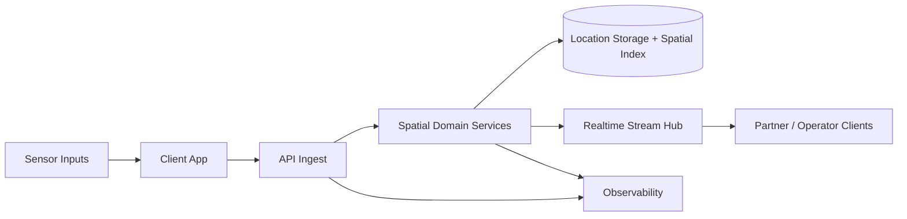
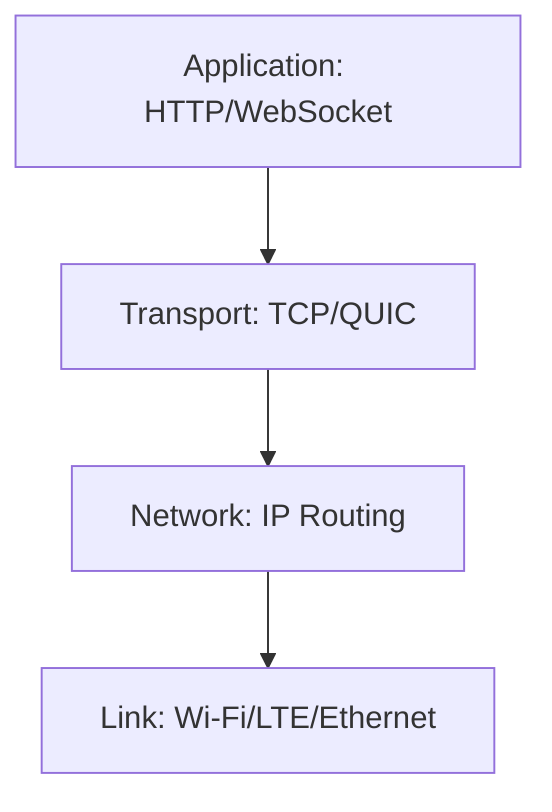
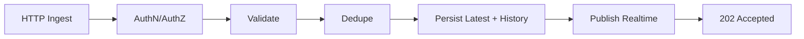
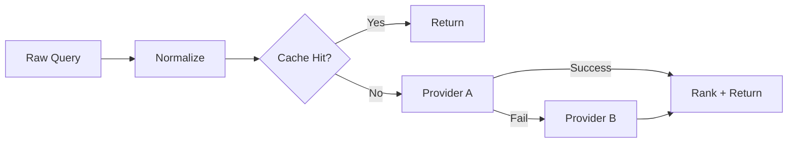
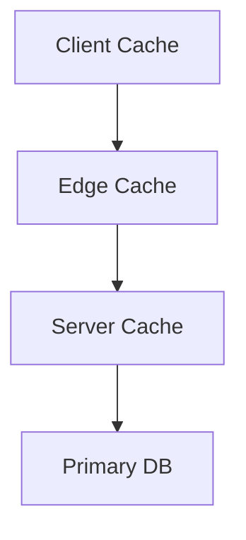
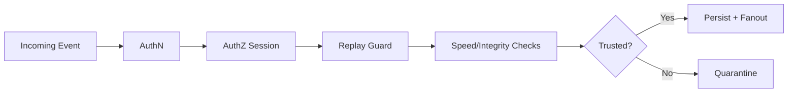
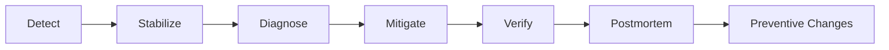
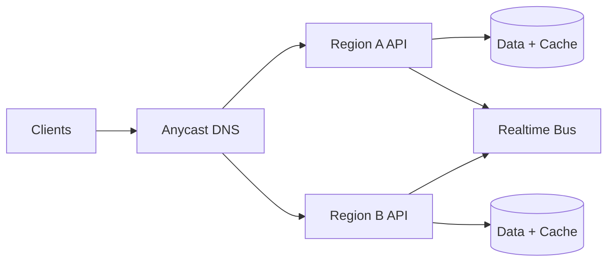
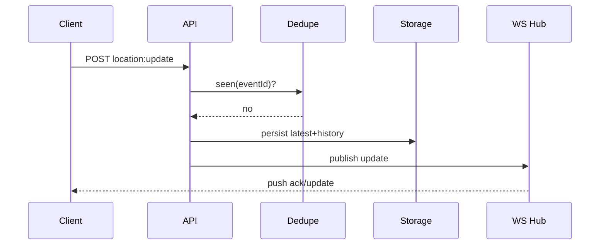
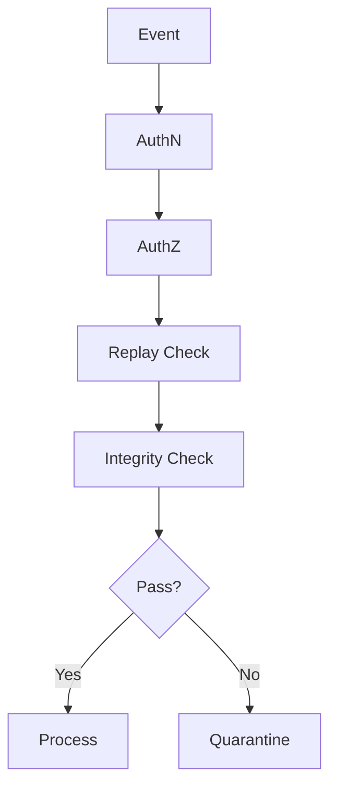

# The Cartographer of Packets
## Learn-GIS Edition
### A Narrative Field Guide to Becoming a Top 1% GIS Network Engineer

> This edition is intentionally rewritten in a novel-style learning arc.
> It merges overlapping chapters, removes filler, and keeps only material that builds real engineering capability.

---

## How This Book Works

You are the protagonist.

You begin as a strong software engineer with no GIS or networking foundation. Over twelve acts, you build intuition, then systems, then judgment under production pressure.

Every act has:

- `Story`: the narrative scene that frames the problem.
- `Build`: concrete technical concepts and code.
- `Drill`: practical tasks.
- `Checkpoint`: what mastery looks like.

Keep using `learn-gis/field-journal.md` as your training log.

---

## Table of Contents

1. Act I - The Map That Lied (GIS + Networking Foundations)
2. Act II - The Shape of the Earth and the Shape of Data
3. Act III - Packets, Protocols, and Real-Time Truth
4. Act IV - Building the Core Backend (Node/Bun + TypeScript)
5. Act V - Geocoding, Routing, and Rendezvous Intelligence
6. Act VI - Reliability, Caching, and Performance Under Load
7. Act VII - Security and Integrity of Location Systems
8. Act VIII - Incidents, Postmortems, and Operational Leadership
9. Act IX - Enterprise Architecture and Cost Engineering
10. Act X - Capstone Build (Node Track and Bun Track)
11. Act XI - Master Drills, Interview Trials, and Certification
12. Act XII - The Professional Standard
13. Appendices - Glossary, Checklists, Mermaid Atlas

---

## Act I: The Map That Lied

At 2:13 AM, your phone buzzed like a warning siren.

A logistics map in production showed 186 riders in a river.
Not by the river. In it.

Support escalated. Product asked for ETA confidence. A director asked if GPS had failed globally.

You opened traces, expecting fire.
CPU looked fine. Database looked fine. Queue depths looked fine.

Then you found it.

A payload transformation step had silently switched coordinate order from `[lon, lat]` to `[lat, lon]` for one event path during a refactor.

No crash. No exception.
Just wrong reality painted with perfect uptime.

That is where this book starts.

### Build: What GIS Engineering Really Is

GIS in production is not map decoration.
GIS is truth management for location under uncertainty.

Production truth depends on three engines:

1. Spatial engine: geometry, projections, distance, containment.
2. Network engine: event delivery semantics under lossy conditions.
3. Reliability engine: detection, mitigation, and recovery discipline.



### Build: Your First Non-Negotiable Invariant

All coordinate payloads must be validated at every boundary.

```ts
export function assertLonLat(lon: number, lat: number): void {
  if (!Number.isFinite(lon) || !Number.isFinite(lat)) {
    throw new Error("coordinate must be finite numbers");
  }
  if (lon < -180 || lon > 180) {
    throw new Error("longitude out of range");
  }
  if (lat < -90 || lat > 90) {
    throw new Error("latitude out of range");
  }
}
```

### Drill

1. Write 20 tests for coordinate validation.
2. Include `NaN`, `Infinity`, strings, and boundary values.
3. Add one integration test where invalid coordinates are rejected before persistence.

### Checkpoint

You pass Act I when you can explain why a system can be "healthy" and still wrong.

---

## Act II: The Shape of the Earth and the Shape of Data

You met your mentor in a war room with two whiteboards.
On one board: a globe.
On the other: a flat tile grid.

"Everything you build," she said, "lives in the tension between those boards."

### Build: Coordinate Systems

- `EPSG:4326` (`WGS84`): latitude/longitude, geodetic coordinates.
- `EPSG:3857` (Web Mercator): projected coordinates for web map tiles.

If one service emits `4326` and another assumes `3857`, distances and map rendering lie quietly.

### Build: Distance Models

Straight-line distance and road distance are different products.

Use Haversine for quick geodesic approximation.
Use route engines for travel-time decisions.

```ts
const EARTH_RADIUS_M = 6371000;

export function haversineMeters(lon1: number, lat1: number, lon2: number, lat2: number): number {
  const toRad = (d: number) => (d * Math.PI) / 180;
  const dLat = toRad(lat2 - lat1);
  const dLon = toRad(lon2 - lon1);
  const a =
    Math.sin(dLat / 2) ** 2 +
    Math.cos(toRad(lat1)) * Math.cos(toRad(lat2)) * Math.sin(dLon / 2) ** 2;
  const c = 2 * Math.atan2(Math.sqrt(a), Math.sqrt(1 - a));
  return EARTH_RADIUS_M * c;
}
```

### Build: GeoJSON Contract

GeoJSON coordinates are always `[longitude, latitude]`.

```json
{
  "type": "Feature",
  "geometry": {
    "type": "Point",
    "coordinates": [3.3792, 6.5244]
  },
  "properties": {
    "source": "mobile-gps"
  }
}
```

### Drill

1. Build a utility module with: validator, Haversine, and GeoJSON point formatter.
2. Add property tests for distance symmetry and near-zero self-distance.

### Checkpoint

You pass Act II when you can explain projection mismatch without opening documentation.

---

## Act III: Packets, Protocols, and Real-Time Truth

The first time you watched packet captures during a reconnect storm, it felt like a city in panic.
Connections opened and died in waves.
Retries aligned into synchronized spikes.

Your mentor leaned over: "This is not chaos. This is behavior. Learn it."

### Build: Practical Layer Model



### Build: Delivery Semantics

For location updates, a practical default is:

- at-least-once delivery
- idempotent processing
- dedupe by event ID with TTL

```ts
type SeenStore = {
  has(id: string): Promise<boolean>;
  put(id: string, ttlSec: number): Promise<void>;
};

export async function dedupeEvent(store: SeenStore, eventId: string): Promise<boolean> {
  if (await store.has(eventId)) return true;
  await store.put(eventId, 90);
  return false;
}
```

### Build: Event Envelope

```json
{
  "id": "evt_01k",
  "type": "location:update",
  "schemaVersion": 1,
  "sessionId": "ses_abc",
  "ts": 1773842900000,
  "payload": {
    "userId": "u_42",
    "coord": { "lon": 3.3792, "lat": 6.5244 },
    "accuracyM": 11
  }
}
```

### Drill

1. Simulate duplicate sends with same event ID.
2. Verify duplicates return successful semantic ack and no duplicate writes.
3. Add retry with jitter on client side.

### Checkpoint

You pass Act III when reconnect storms no longer feel mysterious.

---

## Act IV: Building the Core Backend (Node/Bun + TypeScript)

You were handed a blank repo and one sentence:

"Build something we can trust at 3 AM."

### Build: Architecture Skeleton

```txt
src/
  domain/
    location/
    session/
  api/
    http/
    ws/
  infra/
    db/
    cache/
    pubsub/
  app/
    bootstrap.ts
```

### Build: Ingest Pipeline



### Build: Typed Contracts

```ts
export type Coord = { lon: number; lat: number };

export type LocationIngestInput = {
  eventId: string;
  sessionId: string;
  userId: string;
  coord: Coord;
  clientTs: number;
  accuracyM?: number;
};

export type LocationIngestAck = {
  accepted: boolean;
  duplicate: boolean;
  serverTs: number;
};
```

### Build: Runtime Choice

Node and Bun are both valid.
The mature answer is not loyalty; it is parity testing.

- Run identical functional tests.
- Run identical load tests.
- Compare p95 and p99 under reconnect storms.

### Drill

Implement the full ingest service in one runtime this week and port it to the other next week.

### Checkpoint

You pass Act IV when both runtimes pass the same acceptance suite.

---

## Act V: Geocoding, Routing, and Rendezvous Intelligence

Product wanted a "meet halfway" feature in two weeks.
Design wanted elegance.
Finance wanted low API spend.
Users wanted fairness.

Welcome to geospatial product engineering.

### Build: Geocoding Gateway

Pipeline:

1. normalize query
2. cache lookup
3. provider A call with timeout
4. provider B fallback
5. confidence and provenance in response



### Build: Midpoint and Venue Ranking

A robust ranking function balances both users' ETA, venue quality, and operational constraints.

```ts
type VenueScoreInput = {
  etaAmin: number;
  etaBmin: number;
  rating: number;
  openNow: boolean;
};

export function scoreVenue(v: VenueScoreInput): number {
  const fairnessPenalty = Math.abs(v.etaAmin - v.etaBmin) * 0.7;
  const travelPenalty = (v.etaAmin + v.etaBmin) * 0.5;
  const closedPenalty = v.openNow ? 0 : 40;
  return v.rating * 10 - fairnessPenalty - travelPenalty - closedPenalty;
}
```

### Drill

1. Build a venue ranker with simulated inputs.
2. Add stale-location penalties.
3. Compare top-5 results before and after fairness constraints.

### Checkpoint

You pass Act V when your recommendation logic is explainable to product and users.

---

## Act VI: Reliability, Caching, and Performance Under Load

You ran load tests at midnight.
At 1,500 events/sec, the graphs looked good.
At 2,500, outbound queues climbed.
At 3,000, the system still "worked" but freshness degraded silently.

That is the line between demos and production.

### Build: Core SLOs

Define SLOs before launch:

- ingest p95 latency < 300ms
- realtime fanout p99 < 500ms
- websocket reconnect success > 99.5%

### Build: Backpressure Policy

- per-connection queue hard limit
- drop low-priority events first
- disconnect persistently slow consumers

```ts
export function shouldDropLowPriority(queueDepth: number): boolean {
  return queueDepth >= 150;
}
```

### Build: Cache Tiers



### Drill

1. Run a load test with and without cache.
2. Measure p95 and p99 effects.
3. Simulate provider timeout and ensure graceful degradation.

### Checkpoint

You pass Act VI when you can show bottleneck evidence, not guesses.

---

## Act VII: Security and Integrity of Location Systems

Location data can reveal home, routine, and vulnerability.
Treat it like financial data.

### Build: Threat Model

- spoofed location payloads
- replay attacks
- unauthorized websocket subscriptions
- token theft and reuse

### Build: Secure Ingest Path



### Build: Replay Guard

```ts
export async function rejectReplay(
  has: (k: string) => Promise<boolean>,
  put: (k: string, ttlSec: number) => Promise<void>,
  userId: string,
  nonce: string,
  ts: number,
): Promise<void> {
  const now = Date.now();
  if (Math.abs(now - ts) > 60_000) throw new Error("timestamp skew too large");
  const key = `replay:${userId}:${nonce}`;
  if (await has(key)) throw new Error("replay detected");
  await put(key, 120);
}
```

### Drill

1. Implement replay guard middleware.
2. Add impossible-speed quarantine logic.
3. Verify quarantined events are never fanned out.

### Checkpoint

You pass Act VII when abuse attempts produce controlled, observable outcomes.

---

## Act VIII: Incidents, Postmortems, and Operational Leadership

Friday, 6:42 PM.
Release looked clean.
Metrics looked green.
Users reported stale positions.

The problem was not CPU or memory.
It was correctness: a subscribe authorization key dropped `sessionId` in one code path.

### Build: First 10-Minute Incident Protocol

1. declare incident and blast radius
2. assign lead, comms, diagnostics
3. disable high-risk path
4. gather evidence, not opinions
5. publish updates on fixed cadence

### Build: Incident Loop



### Drill

Run three tabletop incidents:

- reconnect storm
- geocoder outage
- unauthorized channel access bug

### Checkpoint

You pass Act VIII when your team can recover predictably without heroics.

---

## Act IX: Enterprise Architecture and Cost Engineering

Great architecture is not just scaling traffic.
It is scaling trust and margin together.

### Build: Cost Model

`cost/session = geocode + route + ws + storage + egress`

Track weekly. Always.

### Build: High-Leverage Optimizations

- adaptive update frequency by movement
- route/geocode caching
- compact realtime payloads
- confidence-aware degradation modes

### Build: Multi-Region Pattern



### Drill

1. Model spend before optimization.
2. Apply two optimizations.
3. Recompute spend and latency impact.

### Checkpoint

You pass Act IX when you can defend architecture in both technical and financial language.

---

## Act X: Capstone Build (Node Track and Bun Track)

You now build the same system twice.
Not for duplication. For truth.

### Shared Requirements

- authenticated ingest endpoint
- dedupe and idempotency
- latest + history persistence
- websocket fanout with authz
- heartbeat and presence
- geocoding gateway fallback
- metrics and incident dashboard

### Node Track Skeleton

```txt
node-track/
  src/
    server.ts
    ingest.ts
    ws-hub.ts
    geocode.ts
    metrics.ts
```

### Bun Track Skeleton

```txt
bun-track/
  src/
    index.ts
    ingest.ts
    hub.ts
    geocode.ts
    metrics.ts
```

### Capstone Acceptance Suite

1. valid ingest accepted
2. duplicate event no-op ack
3. invalid coord rejected
4. unauthorized subscribe denied
5. reconnect storm converges
6. provider A timeout falls back
7. p95/p99 metrics emitted

### Drill

Build both tracks and compare:

- p50/p95/p99 latency
- reconnect convergence time
- developer ergonomics for your team

### Checkpoint

You pass Act X when runtime choice is supported by evidence, not preference.

---

## Act XI: Master Drills, Interview Trials, and Certification

### The 12 Master Drills

1. coordinate invariants under fuzzed input
2. dedupe under duplicate flood
3. ws queue backpressure behavior
4. replay attack simulation
5. geocoder fallback with breaker
6. route ranking fairness test
7. incident response timing drill
8. outbox durability simulation
9. cost-per-session tracking automation
10. trace context end-to-end propagation
11. multi-region failover dry run
12. full postmortem publication

### Interview Trial Prompts

- Explain why healthy uptime can still mean broken GIS truth.
- Design at-least-once realtime ingestion with dedupe.
- Defend Node vs Bun for your organization with rollback plan.
- Walk through first 10 minutes of a stale-map incident.

### Certification Rubric

| Area | Weight |
|---|---:|
| correctness | 25% |
| reliability | 20% |
| security | 20% |
| performance | 15% |
| communication | 10% |
| cost engineering | 10% |

Pass threshold: 80%, with no critical security failures.

---

## Act XII: The Professional Standard

Mastery is not the absence of incidents.
Mastery is the quality of your system and your response when incidents happen.

If you have truly completed this journey, you now think in invariants:

- coordinate truth
- delivery semantics
- authorization boundaries
- latency budgets
- observable behavior
- reversible decisions

The industry has enough demo maps.
Build systems that tell the truth when conditions are ugly.

That is the standard.

---

## Appendices

### Appendix A: Production Readiness Checklist

- Coordinate validators at all boundaries
- Dedupe and idempotency enforced
- Replay protection and authz checks
- SLO dashboards live before launch
- Incident runbooks rehearsed
- Cost model tracked weekly

### Appendix B: Mermaid Atlas

#### B.1 End-to-End Realtime Flow



#### B.2 Security Decision Path



### Appendix C: Glossary (Essential)

- `WGS84`: global GPS coordinate reference standard.
- `Web Mercator`: projected coordinate system for web tiles.
- `Idempotency`: repeated event has same effective outcome.
- `Backpressure`: mechanisms to prevent overload collapse.
- `Replay attack`: repeated valid request/event used maliciously.
- `SLO`: measurable performance/reliability objective.

### Appendix D: 90-Day Training Plan

#### Days 1-30

- master coordinate and protocol fundamentals
- build ingest + dedupe
- write 50 tests

#### Days 31-60

- build websocket fanout and presence
- add security and fallback patterns
- run load + packet-loss tests

#### Days 61-90

- complete Node and Bun capstones
- run incident simulations
- publish one full postmortem and one ADR

---

## Final Letter

You started this journey as a software engineer.
You finish it as a systems engineer for location truth.

When someone asks, "Can we trust this map?"
You now know that answer must come from tests, telemetry, architecture, and discipline.

Carry that standard into every team you join.
